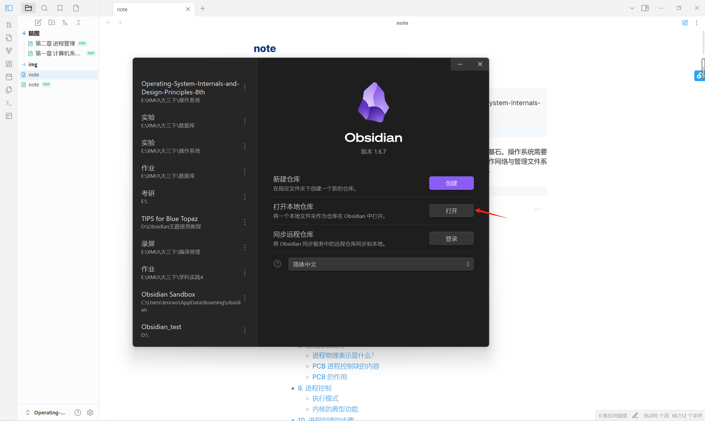
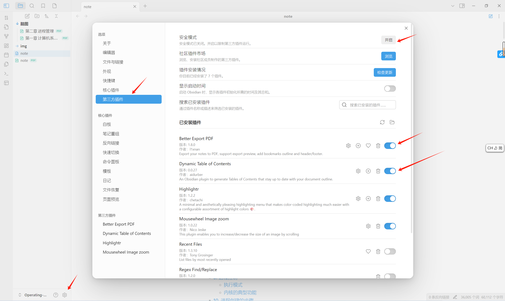

# 笔记范围

负责任的说，经过二编后，这篇笔记应付厦大期中考绰绰有余。(本人复习一个下午+晚上，期中95...但是大家不要一点都不学只看笔记啊啊啊会很痛苦的)

但是对于期末来说，最后几章的内容缺失(不过那几章也不是重点)，可能还需要自己看看老师PPT补充一下。

# 笔记打开方式

这个笔记是用markdown语言+obsidian软件二编的

想自己diy的同学可以下载obsidian软件并将整个source文件夹作为库打开。不想费劲的同学也可以直接使用pdf版本

打开后点击左下角的设置，打开第三方插件，关闭安全模式。

插件部分我认为前两个插件必开，其他大家随意

