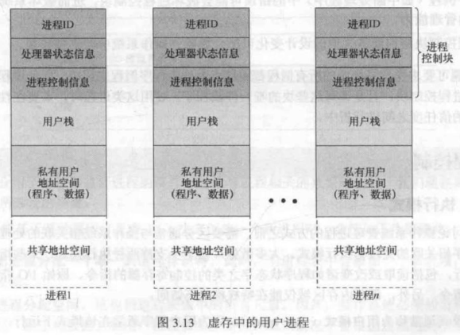

# 操作系统精髓与设计原理 第8版 阅读笔记

> 2020-2-27 Joke-Lin
> 原文博客指路：https://weijun-lin.top/2020/02/28/2020-02-28-Operating-System-Internals-and-Design-Principles-8th-Note/
> 二编：2024-6  邓语苏
>根据厦大计科OS课程补充了一些图片和例题

操作系统是管理计算机硬件与软件资源的系统软件，同时也是计算机系统的内核与基石。操作系统需要处理如管理与配置内存、决定系统资源供需的优先次序、控制输入与输出设备、操作网络与管理文件系统等基本事务。操作系统也提供一个让用户与系统交互的操作界面。—— 维基百科

> 前几章为引言部分 略

```toc
```
##  第二部分 进程

---

### 第三章 进程描述和控制

--------------------------------------------------

#### 1. 进程的几个定义

- 一个正在执行的**程序**
- 一个正在**计算机**上执行的程序实例
- 能分配给**处理器**并由处理器执行的实体
- 由一组执行的**指令**，一个**当前状态**和一组相关的**系统资源**表征的活动单元

#### 2. 基本元素

程序代码 + 数据集

#### 3. 进程控制块 （PCB）

由操作系统创建和管理。可以完成对进程的中断，以及中断后恢复进程的执行。

- 标识符
  - 进程的唯一标识符，用来区分其他进程。

- 状态
  - 新建，运行，就绪，挂起，阻塞，退出

- 优先级
- 程序计数器
  - 保存下一条指令的地址

- 内存指针
  - 代码 / 数据 / 其它进程的指针

- 上下文数据
  - 处理器执行时寄存器里的值

- I/O 状态信息
  - 显式I/O 请求；分配给进程的 I/O 设备； 被进程使用的文件列表

- 记账信息
  - 处理器时间总和、使用的时钟周期总和、时间限制、记账号


#### 4. 进程状态

**轨迹**：进程执行的指令序列

##### 两状态模型

非运行态 $\Leftrightarrow$ 运行态

##### 五状态模型

- 运行态：进程正在执行，假设为一个单处理器计算机，那么一次最多只有一个进程处于此状态
- 就绪态：进程做好了准备，随时可以处于运行态
- 阻塞态：在发生某些事件前不能执行，如 I/O
- 新建态：已创建 PCB 但还未加载到内存中的进程
- 退出态：操作系统从可执行进程组释放出的进程


#### 5. 进程的挂起

**原因**：当所有进程都处于阻塞态时，处理器处于休闲状态。此时将某个进程的一部分或者全部移入磁盘，然后从挂起队列加载一个新进程，放入内存中运行


##### 进程挂起的原因


#### 6. 进程创建和终止

- 进程创建的原因：

	

- 进程终止的原因：

	

#### 7. 操作系统控制结构

- 内存表：跟踪内存和外（虚）存（交换机制）
	- 分配给进程的内存
	- 分配给进程的外存
	- 内存块或虚存块的任何保护属性，比如哪些进程可以访问某些共享内存区域。
	- 管理虚存所需要的任何信息
- I/O 表：管理 I/O 设备和通道
- 文件表：文件管理：是否存在，位置等信息
- 进程表：内存，I/O， 文件是代表进程而被管理的 

#### 8. 进程控制结构

##### 进程物理表示是什么？

进程需要包含：

* 足够的内存空间来保存其程序和数据
* 用于跟踪过程调用和过程间参数传递的栈
* 与进程相关的属性(属性集成为PCB)

进程映像=程序 + 数据 + 栈 + 属性集


进程映像在虚存中的结构如下



##### PCB 进程控制块的内容

- 进程标识信息：存储在PCB中的数字标识符,包括: 进程 ID，父进程 ID，用户 ID

- 进程状态信息（处理器状态信息）：存储所有的程序状态字（PSW）
- 进程控制信息：操作系统协调各种活动进程的额外信息


##### PCB 的作用

> PCB 是操作系统中最重要的数据结构，包含操作系统所需进程的全部信息
>
> PCB 集合定义了 OS 的状态

如何在发生错误和变化时，保护 PCB，具体表现为两个问题：

- 一个例程（如中断处理程序）中的错误可能会破坏进程控制块，进而破坏系统对受影响进程的管理能力
- 进程控制块结构或语义中的设计变化可能会影响到操作系统中的许多模块

#### 9. 进程控制

##### 执行模式

* 特权模式(系统模式、控制模式、内核模式)
* 非特权模式(用户模式)

**原因**：保护操作系统和重要的操作系统表 不受用户程序的干扰

**ELSE**：PCB 中有指示执行模式的位，因事件变化而变化，当用户调用OS服务或中断触发系统例程时，执行模式变为内核模式，返回到用户进程时变为用户模式

##### 内核的典型功能


#### 10. 进程创建的步骤

1. 为新进程分配一个唯一的进程标识符

2. 为进程分配空间

   * 这包括进程映像中的所有元素。

3. 初始化 PCB

   * 进程标识部分

     设置进程ID，用户ID，父进程ID等

   * 处理器状态信息部分

     多数项目初始化为0。

     但程序计数器置为程序入口点。系统栈指针定义为进程栈边界

   * 进程控制信息部分。

     进程状态一般设为就绪或就绪/挂起。

     优先级默认设为最低。除非显式请求。

     默认不拥有任何资源(I/O设备、文件)。除非显式请求或从父进程继承了资源。

4. 设置正确的链接

   * 放入新建/就绪挂起 链表中

5. 创建或扩充其它数据结构

   * 记账文件

#### 11. 进程切换

##### 何时切换进程

> 可在OS从当前正在运行的进程获得控制器的任何时刻发生

下图为可能把控制器交给OS的事件。其中分为**系统中断(中断、陷阱)和系统调用**


- 中断

  - 与当前进程无关的外部事件有关

    > 时钟中断（超过运行时间片），原本运行态的进程转换为就绪态。
    >
    > I/O 中断(I/O活动完成)，原本阻塞态的进程转换为就绪态。
    >
    > 内存失效(引用不在内存中的虚拟地址)。需要从外存中把包含这一引用的内存块调入内存。发出调入内存块的I/O请求，进程进入阻塞态；内存调入成功后，进程转换为就绪态。

  - 控制权首先转给中断处理器，再转给OS例程。

- 陷阱

  - 与当前进程产生的错误或异常条件有关
  - 处理一个错误和一个异常条件

- 系统调用

  - 显示请求，调用操作系统函数

    > 用户进程执行了一个请求I/O操作的指令，将用户进程置为阻塞态。

##### 模式切换步骤

出现中断时，处理器将：

- 将从程序计数器置为中断处理程序的开始地址
- 从用户模式切换到内核模式，以便中断处理代码包含特权指令
- 保存已中断例程的上下文

不一定进行进程切换。只是将用户模式与内核模式之间做切换。

##### 进程切换步骤


1. **保存处理器上下文。**

   包括程序计数器和其他寄存器的值

2. **更新当前处于运行态进程的PCB。**

   将进程状态更改。

   更新其他字段

3. **把当前进程移到相应队列**

4. **选择另一个进程运行**
5. **更新所选进程的PCB**
   将新进程状态改为运行态

6. **更新内存管理数据结构**

7. **载入程序记数器和其他寄存器先前的值，将处理器上下文恢复原状。**

#### 12. 操作系统的执行

> 第二章指出操作系统的两个特殊事实：
>
> - OS 和普通软件以相同的方式运行，也是一个程序
> - OS 会频繁的释放控制权，并依赖于处理器来恢复控制权

##### 无进程内核

在所有进程外部执行操作系统内核，进程概念只适用于用户程序，操作系统则是则是在特权模式下单独运行的实体。如图3.15(a)

##### 在用户进程内运行

操作系统是用户调用的一组例程，在用户进程的环境中执行并实现各种功能。进程映像不仅包括自己的程序，数据，栈还包括**内核程序**的程序，数据，和栈区域。操作系统代码和数据位于共享地址空间中，并被所有用户进程所共享。只需要在同一进程中切换模式，而不需要切换进程。如图3.15(b)

##### 基于进程的操作系统

把操作系统作为一组系统进程来实现。如图3.15(c)

优点：

1. 鼓励模块化操作系统设计原理，使模块间接口最小且最简单 
2. 有些非关键系统功能可简单的用独立的进程来实现（例如监视各种资源和状态的程序）
3. 在多处理器和多机环境中很有用


### 第四章 线程

--------------------------------------------------

#### 1. 进程和线程

##### 进程特点

- 资源所有权：进程包括存放进程映像的虚拟地址空间
- 调度/执行：进程具有执行态和优先级，是可被 OS 调度和执行的实体

> 这两个特点是独立的，为了区分这两个特点，通常将分派的单位称为线程（轻量级进程 LWP ）
>
> 而将资源所有权的单位称为进程（任务）

##### 多线程

> 指OS在单个进程内支持多个并发执行路径的能力

在多线程环境中，**进程定义为资源分配单元和一个保护单元**，与进程相关联的有：

- 容纳进程映像的虚拟地址空间
- 对处理器，其它进程，文件，I/O 的受保护访问

每个**线程**都有：

- 一个线程的执行状态
  - 运行、就绪等

- 未运行时保存的线程上下文
  - 线程可视为进程内运行的一个独立程序计数器

- 一个执行栈
- 局部变量的静态存储空间
- 与其它线程共享的内存和资源的访问


使用线程的几个例子：

- 前台和后台工作
- 异步处理
- 执行速度
- 模块化程序结构

有些活动会影响进程中的所有线程：

* 挂起操作会将进程的地址空间换出内存，为其他进程腾出位置。由于所有线程共享同一个地址空间，因此它们会被同时挂起。
* 类似的。进程终止时会使进程中的所有线程都终止。

**线程的优点**

> **Why** : 因为线程共享一个地址，内存，文件空间，ULT中不用切换到内核，进程切换需要内核

- 创建线程的时间少于创建进程的时间
- 终止线程的时间少于终止进程的时间
- 同一个内线程切换时间少于进程间切换的时间
- 线程提高了不同执行程序间通信的效率

##### 线程的功能

线程状态：就绪态，运行态，阻塞态

线程状态改变的基本操作：

* 派生
  * 进程中的线程可以在同一进程中派生另一个新线程。
* 阻塞
* 解除阻塞
  * 发生阻塞一个线程的事件后，将线程移到就绪队列中
* 结束
  * 线程完成后，会释放其寄存器上下文和栈

线程同步：同步线程的活动是它们互不干扰且不破坏数据结构。如两个线程向一个链表加入元素，则可能会丢失一个元素或破坏链表结构。

#### 2. 线程分类


##### 用户级（ULT）

管理线程的所有工作都由应用程序完成，**内核意识不到线程的存在**（线程在内核看来和进程是一致的）。任何应用程序都可以设计成多线程程序。线程库提供了所有关于线程的操作。

**ULT相较于KLT的优点**：

- 所有线程都在一个进程的用户地址空间中，**线程切换不需要内核模式特权**，因此不需要切换到内核状态，节省了两次状态转换，用户到内核和内核到用户
- 调度因程序的不同而不同
- ULT 可以在任何操作系统中运行

**ULT 相较于 KLT 的缺点**：

- 许多系统调用都会引起阻塞。ULT 执行一个系统调用的话，不仅阻塞当前线程，也会阻塞进程内的所有线程。
- 多线程应用程序不能利用多处理技术，这里线程对操作系统是不可见的，内核一次把一个进程分配给处理器，这样一个进程内只能运行一次一个线程，相当于在一个进程内实现了多道程序设计。(相当于操作系统看来，是多个进程在轮流请求一个内核。)

##### 内核级线程（KLT）

管理线程的所有操作由内核完成，应用级只有一个到内核线程实施的应用编程接口（API）

**KLT 的优点：**

- 内核可以把进程中的多个线程调度到多个处理器中
- 进程的一个线程阻塞时，不影响其它线程的调度
- 内核例程也可以是多线程的

**KLT 的缺点：**

- 线程转换时 需要切换到内核状态

##### 混合

> 结合两者优点

#### 3、多核和多线程

                                      

> 并不是核越多越好，管理起来越麻烦，会有更多多余的开销
>

**影响多核系统上软件性能的因素**

- 核的数量
- 串行代码比例
- 多处理器任务调度和通信以及高速缓存一致性带来的额外开销

### 第五章 并发性：互斥和同步

---------------------------------------------------------------------------

操作系统的核心问题是进程和线程的管理：

- 多道程序设计技术：管理**单**处理器中的**多个进程**
- 多处理器技术：管理**多**处理器中的**多个进程**
- 分布式处理器技术：管理多台分布式计算机中多个进程的执行（集群）

***并发是所有问题的基础，也是操作系统设计的基础（设计问题：进程通信，资源共享和竞争）***

出现的环境：

- 多应用程序：程序间动态共享处理器时间
- 结构化应用程序：。。。
- 操作系统结构：。。。


#### 1、并发的原理

##### 并发处理的问题（难点)

- 全局资源的共享充满了危险


- OS很难对资源进行最优化分配

- 定位程序设计错误非常困难               

```c
zvoid echo() {
    chin = getchar();//全局变量
    chout = chin;
    putchar(chout);
}
```

这个打印字符的程序很容易发生数据的丢失(两个进程同时使用此程序时)，出现这种问题的原因是中断可能在进程的任何地方发生，解决方案是控制对共享资源的访问。

##### 竞争条件

竞争条件发生在多个进程或线程读写数据时，其最终结果取决于进程的指令执行顺序

##### 进程的交互


有几个基本概念：

***临界资源*** ：就是上面谈到的一个不可分享的资源

***临界区***：使用这一部分资源的程序称为程序的临界区

***死锁***：两个进程互相控制两个资源，但又还需要对方持有的资源才可以继续工作，这样就产生了死锁（两个进程都不能继续工作）

***饥饿***：有三个进程 ABC ，每个进程都需要访问资源 R，资源被 AC 交替访问，却始终没有分配给 B 这样 B 就处于饥饿状态

##### 互斥的要求

> 互斥：简单来说，就是两个或多个进程需要访问一个不可分享的资源的保护机制

1. 必须强制实施互斥：在与相同资源或共享对象的临界区有关的所有进程中，**一次只允许一个进程进入临界区**。
2. 一个在**非临界区停止的进程不能干涉其他进程**。
3. 绝不允许出现需要访问临界区的进程被无限延迟的情况，即**不会死锁或饥饿**
4. **没有进程在临界区中时**，任何需要进入临界区的进程必须能够**立即进入**。
5. 对相关进程的执行速度和处理器的数量没有任何要求和限制。
6. 一个进程**驻留在临界区中的时间**必须是**有限**的。

可以简写为：
* *忙则等待*：一次只允许一个进程进入临界区
* *空闲则入*：当没有进程在临界区中时，任何需要进入临界区的进程必须能够立即进入, 也就是说一个在非临界区停止的进程必须不干涉其他进程。
* *有限等待*：一个进程驻留在临界区的时间是有限的。
#### 2-1互斥：软件解决方法
##### Dekker's  算法
###### 版本1
```c
/* main.c*/
int turn=0;//共享一个全局变量
turn==i;//轮到进程i进入临界区
```
```c
/* PROCESS 0 */
while (turn !=0){
/*do nothing */
}
/*critical section*/;
turn=1;

```
```c
/* PROCESS 1 */
while (turn !=1){
/*do nothing */
}
/*critical section*/;
turn=0;

```
* 是否实现忙则等待？
	是
* 假设P0正在临界区里，此时P1试图进入临界区，它能做到吗？
	不能
* 是否实现空闲则入？
  否。
  若P0停在while之前的区域(P0不在临界区)，P1仍然不可以进入临界区。
* 缺点：
	* 进程在使用其临界区时必须严格交替；因此，执行速度由两个进程中较慢的进程决定。(满足互斥，但是顺序一定)
	* 如果一个进程失败，另一个进程将被永久阻止。(不满足空闲则入)
###### 版本2
```c
/* main.c*/
enum boolean{false=0;true=1};
boolean flag[2]={0,0};

/* PROCESS 0 */
while (flag[1]){
/*do nothing */
}
flag[0]=true;
/*critical section*/;
flag[0]=false;


/* PROCESS 1 */
while (flag[0]){
/*do nothing */
}
flag[1]=true;
/*critical section*/;
flag[1]=false;

```
缺点：
* **不满足互斥**
	 如果一开始`flag[0]=flag[1]=false`
* 会导致死锁
	 如果一开始`flag[0]=flag[1]=true`
* 若一个进程在临界区失败，另一个进程可能会被阻塞(**不满足有限等待**)
###### 版本3
```c
boolean flag[2];
f1ag[i]==true;//表示进程i在临界区

/* PROCESS 0 */
flag [0]=true;
while (flag [1]){
/*do nothing */;
}
/*critical section*/;
flag [0]=false;


/* PROCESS 1 */
flag [1]=true;
while (flag [0]){
/*do nothing */;
}
/*critical section*/;
flag [1]=false;

```
* 保证互斥
* 存在死锁
	 如果一开始`flag[0]=flag[1]=true`
* 如果一个进程在某个位置失败，另一个进程可能会被阻塞
###### 版本4
```c
/* PROCESS 0 */
flag[0]=true;
wh11e(flag[1]){
flag [0]=false;
/*delay */
flag [0]=true;
}
/*critical section*/;
flag[0]=false;

/* PROCESS 1 */
flag[1]=true;
wh11e(flag[0]){
flag [1]=false;
/*delay */
flag [1]=true;
}
/*critical section*/;
flag[1]=false;
```
* 可以打破死锁，但是可能会变成活锁。
	![[Dekker4.png]]
###### 版本5（正确的版本)
![[Dekker5.png]]
##### Peterson's 算法

##### 面包店算法

因为其思想来自于面包店或其他商店，每名顾客在到达时都得到一个票号，并按票号依次得到服务。
算法如下：
```c
boolean choosing[n];
int number[n];
while(true){
	choosing[i]=true;
	number[i]=1+getmax(number[],n);//获得一个最大的唯一编号
	choosing[i]=false;
	for(int j=0;j<n;j++){
		while(choosing[j]){};//等待其他进程选择完编号
		while((number[j]!=0)s&&(number[j],j)<(number[i],i)) {};//等待比i更小的进程先执行
	/*临界区*/;
	number[i]=0:
	/*其余部分*/;
}
```
- `choosing` 数组用于标记每个进程是否正在选择编号。当一个进程正在选择编号时，对应的 `choosing[i]` 被设置为 true。
- `number` 数组用于记录每个进程的编号。0表示不持有编号。
数组choosing和number分别初始化为false和0。每个数组的第i个元素可由进程i读或写，但其他进程只能读。表达式(a,b)<(c,d)定义为
$$(a<c)或(a=c且b<d)$$
* 实现了互斥
	进程会按照编号顺序依次进入临界区
* 避免了死锁
		如果有其他进程在选择编号，当前进程会等待。不会持有资源导致死锁
#### 2-2互斥：硬件的支持
##### 中断禁用

```c
while(true) {
    /* 禁用中断 */
    /* 临界区 */
    /* 启用中断 */
    /* 其余部分 */
}
```

在**单处理器**中：
临界区不能被中断，所以可以保证互斥，为了保证互斥只需要保证一个进程在访问资源的时候不被中断。
在**多处理器**中：
当一个计算机系统含有多个处理器时，通常可能有多个进程同时执行。这种情况下，中断不能保证互斥。

这种方法的代价非常高。由于处理器被限制得只能交替执行程序，因此执行的效率会明显降低。***几个处理器对内存的访问不存在主从关系，处理器之间的行为是无关的，表现出一种对等的关系，处理器之间没有支持互斥的中断机制。***

##### 专用机器指令

在硬件级别上，对存储单元的访问排斥对相同单元的其它访问，因此处理器的设计人员提出了一些机器指令，用与**保证两个动作的原子性**（不能被中断的指令），**在这个指令执行的过程中，任何其它指令访问内存都将被组织，而且这些动作在一个指令周期中完成**

- **比较和交换指令：**

定义如下：

```c
int compare_and_swap(int *word, int testval, int newval)
{
    int oldval;
    oldval = *word;
    if(oldval == testval) *word = newval;
    return oldval;
}
```

使用一个测试值检查一个内存单元，如果内存单元的当前值是 `testval` ，就使用 `newval` 取代该值，否则保持不变，并返回旧内存值。因此如果返回值和测试值相同，表示内存单元已经被更新，整个过程按原子操作执行，不接受中断。这个过程的另一个版本为返回 `bool` 值，判断是否完成交换

- **exchange指令**

定义如下：

```c
void exchange(int *register, int *memory)
{
    int temp;
    temp = *memory;
    *memory = *register;
    *register = temp;
}
```


**忙等待（自旋等待）**：进程在得到临界区访问权之前，它只能继续执行测试变量的指令来得到访问权，除此之外不能做任何事情

对于上图 **a** ,唯一可以进入临界区的进程是发现 bolt 为0的那个进程，并把bolt置为1在它访问临界区的时候，此时其它的进程都处于忙等待中，访问结束后继续将 bolt 置为 0，此时下一个可以进入临界区的进程就是在这之后最早执行 `compare&swap` 指令的进程

对于上图**b** ,工作原理和 **a** 几乎一致。由于变量初始化的方式和交换算法的本质，下面的表达式恒成立：

$$ bolt + \sum_ikey_i = n $$

若 `bolt = 0` ，则没有任何一个进程在它的临界区中，若 `bolt = 1` ，则只有一个进程在临界区中，且为 **key为 0**的那个进程

##### 机器指令方法的特点

有如下的优点：

- 适用于单处理器或共享内存的多处理器上的任意数量的进程
- 简单且易于证明
- 可以用支持多个临界区，每个临界区可以用它自己的变量定义

但也有一些严重的缺点：

- 使用了忙等待：在一个进程在等待进入临界区时，它依然在消耗处理器时间
- 可能饥饿：选择哪个等待进程时任意的，因此有些进程会被无限拒绝进入
- 可能死锁：考虑单处理器下的情况：进程P1执行专用指令（上面的两个）并进入临界区，然后P1被中断并交给更高优先级的P2执行，P2由于互斥机制讲被拒绝访问，但是由于P1优先级低，它也永远不会被调度执行

#### 3、信号量

> <https://www.cnblogs.com/jhcelue/p/7080146.html>

讨论的是提供并发性的操作系统和设计语言的机制

常用的并发机制：


基本原理如下：

两个或多个进程可以通过简单的信号进行合作。强迫一个进程在某个位置停止，直到它接受到一个特定的信号，其中使用了一个称为**信号量**的特殊变量。通过信号量 s 传送信号，进程须执行原语  `semSignal(s)`  要通过信号量 s 接受信号需要执行原语 `semWait(s) ` 若相应信号未发送则阻塞进程，直到发送完为止

为达到预期效果，可把信号量视为一个值为整数的变量，定义了三个操作：

- 一个信号量可以初始化为非负数
- `semWait` 使信号量**减 1，若值变成负数**，则**阻塞**执行 `semWait` 的进程，否则继续执行
- `semSignal` 操作使信号量**加 1 ，若值小于等于 0** ，则被 `semWait` 操作阻塞的进程**解除阻塞**

信号量为正数时，代表发出 `semWait` 后可以继续执行的进程数量，信号量为负数时，每个 `semSignal` 操作都会将等待进程中的一个进程解除阻塞

对于信号量有三个重要结论：

- 通常，在进程对信号量-1之前，无法提前知道该信号量是否会被阻塞
- 当进程对信号量+1后，会唤醒另一个进程，两个进程继续并发运行。而在一个单处理器系统中，无法知道哪一个进程会继续运行
- 向信号量发出信号后，不需要知道是否有另外一个进程在等待，被解除阻塞的进程数要么没有，要么为1

信号量原语的定义：

```c
struct semaphore {
    int count;
    queueType queue;
}
void semWait(semaphore s)
{
    s.count--;
    // --之后小于0 说明原来 count <= 0
    if (s.count < 0) {
        // 把当前进程插入队列
        // 阻塞当前进程
	}
}
void semSignal(semaphore s) 
{
    s.count++;
    // ++之后小于等于0 说明原来 count < 0
    if (s.count <= 0) {
        // 把进程P从队列移除
        // 把进程P插入就绪队列
        // 这个进程P是未知的
	}
}
```

二元信号量的定义：

```c
struct binary_semaphore {
    enum {zero, one} value;
    queueType queue;
}
void semWaitB(binary_semaphore) 
{
    if(s.value == one) s.value = zero;
    else {
        // 插入阻塞队列
	}
}
void semSignalB(semaphore s)
{
    if(s.queue is empty()) s.value = one;
    else {
        // 将进程P解除阻塞
	}
}
```

> 理论上二元信号量更易于实现，且可以证明==与普通信号具有同样的表达能力==，非二元信号量也称作**计数信号量**或**一般信号量**

*想把二元信号量当锁用的话，将其初始化为1--临界区前semWait，临界区后semSignal；
若想做同步，初始化为0--前操作后semSignal，后操作后semWait。*

与二元信号量有关的还有***互斥锁（Mutex）***。互斥是一个编程标志位，用来获取和释放一个对象。可以对一个资源进行**加锁**和**解锁**操作，即为置0和置1，可以由互斥量和二元信号量实现，二者区别在于，**互斥量解锁和加锁的进程必须是同一个进程。二元信号量进行加锁操作，而由另一个进程解锁**

- 强信号量：进程按照FIFO策略将进程从队列溢移除的信号量
- 弱信号量：没有规定队列移除顺序的信号量

可以理解==强信号量不会导致饥饿，而弱信号量可能导致饥饿==

**信号量机制示例**


##### 互斥
使用信号量的互斥：*想把信号量当锁用的话，将其初始化为1--临界区前semWait，临界区后semSignal；*

```c
const int n = /*进程数*/;
semaphore s = 1;
void P(int i)
{
    while(true) {
        semWait(s);
        //临界区
        semSignal(s);
        //Else
	}
}
void main() {
    parbegin(P(1), P(2), ..., P(n));
}
```

使用信号量实现互斥的实例：


##### 同步
使用信号量实现同步：*若想做同步，初始化为0--前操作后semSignal，后操作后semWait。*

实现两进程的同步关系，是在其中一个进程中执行semWait，另一进程中执行semSignal
```c
semaphore S=0;
P1(){
...
semSignal(s);
...
}
P2(){
semWait(s);
...
...
}
```
若先执行到 semSignal(S) 操作，则 S++ 后 S=1。之后当执行到 semWait(S) 操作时，由于 S=1，表示有可用资源，会执行 S--，S 的值变回 0， P2 进程不会执行 block 原语，而是继续往下执行代码4。

若先执行到 semWait(S) 操作，由于 S=0，S-- 后 S=-1，表示此时没有可用资源，因此semWait操作中会执行 block 原语，主动请求阻塞。之后当执行完代码2，继而执行 semSiganl(S) 操作， S++，使 S 变回 0，由于此时有进程在该信号量对应的阻塞队列中，因此会在 V操作中执行 wakeup 原语，唤醒 P2 进程。这样 P2 就可以继续执行 代码4 了
##### 简化版生产消费者问题
**问题描述**：有一个或多个生产者生产某种类型的数据，并放置在缓冲区中；有一个消费者从缓冲区中取数据，每次取一项，任何时候只有一个主体访问缓冲区。
**问题是要确保：** 当缓冲区已满时，生产者不会继续向其中添加数据，当缓冲区为空时，消费者不会从中移走数据

假设缓冲区只能容纳一个元素，count=0代表缓冲区为空,count=1代表缓冲区不为空

![[Pasted image 20240425160745.png]]
**缺陷：** 会出现消费者在缓冲区为空时试图取数据
![[Pasted image 20240425160825.png]]
**改进：** *生产者或消费者被唤醒后应该再次检查count的值*
**最终：**
![[Pasted image 20240425161106.png]]
##### 生产者消费者问题

**问题描述**：有一个或多个生产者生产某种类型的数据，并放置在缓冲区中；有一个消费者从缓冲区中取数据，每次取一项，任何时候只有一个主体访问缓冲区。

**问题是要确保：** 当缓冲区已满时，生产者不会继续向其中添加数据，当缓冲区为空时，消费者不会从中移走数据


###### 无限缓冲区
首先假设缓冲区是无限的，且是一个线性数组，可以使用二元信号量和计数信号量实现。
只需要用两个信号量即可，一个用来做互斥锁，一个用来对消费者做同步。
![[Pasted image 20240425161626.png]]
```c
Append (){
	b[in]=v;
	in++;
}
Take (){
	w=b[out];
	out++;
}
```
**二元信号量错误的方法**：

```c
int n;	// 缓冲区剩余生产量
// delay：用于解决空的时候消费者不移走数据
// s：用于互斥,控制资源访问
binary_semaphore s = 1;//二元信号初始化为1用来当锁，做互斥
binary_semaphore delay = 0;//二元信号初始化为0用来做同步。
void producer() {
    while(true) {
        produce();
        semWait(s);//加锁
        append(); // 正式将数据加入缓冲区
        n++;
        // 告诉消费者缓冲区已经有数据了
        if (n == 1) //说明在n++前，n=0，可能有消费者在等待
	        semSignal(delay);//解锁
        semSignal(s);//解锁
	}
}
void consumer() {
    semWait(delay);
    while(true) {
        semWiat(s);//加锁
        take();
        n--;
        semSignal(s);//解锁
        consume();
        // 消费完之后阻塞当前进程 因为在此循环中delay不会为1
        if (n == 0) //p1
	        semWait(delay);
	}
}
void main() {
    n = 0;
    parbegin(producer,consumer);	//创建线程/进程
}
```

> 对于p1语句存在以下问题：
> 锁没有保护这一条，可能在判断完这一条后，中断去运行其他进程并将n的值改变。
> 此时当前消费者还没有加入delay。其他生产者也无法将其唤醒。
> 等切回来的时候，反而把自己放在delay中，可能将来就没有人来唤醒他。
> 
> 因此考虑：锁应该保护到整个if语句后
```c
if (n == 0) //p1
	semWait(delay);
semSignal(s);
 ```
> 但是这样又会存在若`n==0`，该消费者带着锁去delay了，这把锁无法释放，消费者也无法生产。会造成死锁。

为什么是错误的，可能造成消费完之后继续取
![[wrongInProducer_Consumer.png]]

也就是==在消费者消费之后已经不属于互斥资源保护区，发生中断之后不能保护原有变量的值==，正如上图第10行。
本来n=0、delay=0应该阻塞消费者进程，但是由于中断使 n++，并且有重新将 delay 置1.
而后恢复消费者进程消费完缓冲区之后 delay 信号仍然为1所以，此时缓冲区为空但是并不会阻塞进程，所以还会继续从已经为空的缓冲区拿东西（也就是 delay 信号并不能匹配当前状态了）

**二元信号量正确的方法**：

```c
int n;	// 缓冲区剩余生产量
// delay：用于解决空的时候消费者不移走数据
// s：用于互斥,控制资源访问
binary_semaphore s = 1, delay = 0;
void producer() {
    while(true) {
        produce();
        semWait(S);
        append(); // 正式将数据加入缓冲区
        n++;
        // 告诉消费者缓冲区已经有数据了
        if (n == 1) semSignal(delay);
        semSignal(S);
	}
}
void consumer() {
    int m;
    semWait(delay);
    while(true) {
        semWiat(s);
        take();
        n--;
        // 保护变量m这样就不怕之前的n被修改，m属于此进程的不会被篡改
        m = n;//将n暂存在局部变量m，m只受当前进程变化的影响
        semSignal(s);
        consume();
        // 消费完之后阻塞当前进程 因为在此循环中delay不会为1
        if (m == 0) semWait(delay);
	}
}
void main() {
    n = 0;
    parbegin(producer,consumer);	//创建线程/进程
}
```

使用一般信号量（计数信号量），可得到一种更好的解决方法，如下

```c
// 直接把n和信号量联系起来
semephore n = 0;//代表当所生产出来的东西的数量
semephore s = 1;//互斥锁
void producer() {
    while(true) {
        produce();
        semWiat(s);
        append();
        semSignal(s);
        semSignal(n);
	}
}
void consumer() {
    while(true) {
        semWiat(n);//若n=0会被阻塞
        semWait(s);
        take();
        semSignal(s);
        consume();
	}
}
void main()....
```
* 将semSignal(s)与semSignal(n)互换无所谓
```c
        semSignal(s);
        semSignal(n);
        //更改为
        semSignal(n);
        semSignal(s);
```
* 将semWait(n)与semWait(s)互换不行
```c
        semWiat(n);//若n=0会被阻塞
        semWait(s);
        //更改为
        semWiat(s);
        semWait(n);//若n=0会被阻塞
```
如果n=0时，消费者被阻塞，互斥锁无法释放，生产者也无法生产，因此陷入死锁。
结论：*实现互斥的semWait操作一定要在实现同步的semWait操作之后。semSignal操作不会导致进程阻塞，因此两个semSignal操作顺序可以交换*
###### 有限缓冲区
![[Pasted image 20240425165748.png]]
```c
Append (){
	b[in]=v;
	in=(in+1)%n;
}
Take (){
	w=b[out];
	out=(out+1)%n;
}
```
如果是有限缓冲区的话，只需要对缓冲区大小也设置信号量保护即可。
需要用三个信号量：
1. 互斥锁 
2. 消费者同步 
		初始值设为0，因为一开始缓冲区为0，消费者可用的缓冲区为0
3. 消费者同步(缓冲区保护)
		初始值设为sizeofBuffer，因为一开始缓冲区为0，生产者可用的缓冲区为sizeofBuffer

```c
const int sizeofBuffer = //缓冲区大小
semephore n = 0, s = 1, e = sizeofBuffer;
void producer() {
    while(true) {
        produce();
        semwait(e);	// e表示缓冲区中空的个数。检查缓冲区是否已满(若满则阻塞)
        semWiat(s);//加锁
        append();
        semSignal(s);//解锁
        semSignal(n);
	}
}
void consumer() {
    while(true) {
        semWiat(n);//检查缓冲区是否为空(若空则阻塞)
        semWait(s);
        take();
        semSignal(s);
        semSignal(e);	// 已经消耗一个 有空位了
        consume();
	}
}
void main()....
```

##### 信号量的实现


即使用 `s.flag` 的互斥原语实现了信号量操作的原子性

#### 4、管程
***通过锁来实现整体互斥，使用条件变量实现同步。***
***管程=锁+条件变量***

> 管程是一种程序设计语言结构（ C/C++ 语言没有 JAVA 支持）
>
> 它提供的功能与信号量相同但是更易于控制

##### 管程的特点

> 感觉就是把信号量的一些操作给封装了

1. 局部数据变量只能被管程的过程访问，任何外部过程都不能访问
2. 一个进程通过调用管程的一个子过程进入管程
3. 在管程内部，一次只能执行一个进程
##### 管程的优缺点
优点：
* 管程中的互斥由编译器实现
* 用户不必担心复杂性
缺点：
* 依赖编译器
* 不能实现多台计算机之间的同步
##### 函数

管程通过使用**条件变量**来支持同步，这些条件变量包含在管程中，并且只有在管程中才能被访问

有两个函数可以操作条件变量：

- cwait(x): 在条件x不满足时暂停调用进程的执行
	> 优化了使用在信号量时，先进入互斥锁，再发现同步不满足的导致的死锁问题。
- csignal(x): 使阻塞在x条件上的一个进程就绪

##### 管程的结构
![[tubePassStruct.png]]
* 其中$c_1、c_n$为条件变量，可以为多个。
* 进入管程前有一把互斥锁控制
	 没有成功进入管程的进程要么等待在管程的入口，要么等待在条件变量上

##### 消费者生产者问题(管程)
```c
/* program producerconsumer */
monitor boundedbuffer;
char buffer [N];/*space for N items */
int nextin,nextout;/*buffer pointers*/
int count;/* number of items in buffer */
cond notfull,notempty;/*condition variables for synchronization */

void append(char x){
	if (count =N)
		cwait(notfull);//若为满，等待
	buffer[nextin]=x;
	nextin=(nextin +1)%N;
	count++;
	/*one more item in buffer */
	csignal (notempty);
}
void take (char x){
	if(count=0)
		cwait (notempty);//若为0，等待
	x=buffer[nextout];
	nextout= =(nextout +1)%N;
	count--;
	csignal(notfull);
}
{
nextin=0;nextout= =0;count=0;
}
```

这个例子表明，与信号量相比，管程担负的责任不同。
* **为什么代码中不存在锁？**
	对于管程，它有自己的互斥机制(由编译器保证)：无需互斥锁。两个进程不能同时访问缓冲区。
	因此用户在编写代码的时候只需要关心同步的部分。
* **为什么对count的判断使用的if，不用担心count的值被修改(例如二元信号量错误实现生产消费者问题)？**
	 每次被重新唤醒时，都会重新检查条件变量是否满足。
 ***cwait csignal*** 原语的位置需要注意。管程优于信号量之处在于，所有的同步机制都被限制在管程内部。

##### 管程的通知和广播

上述方法有两个缺陷

- 产生 `csignal` 的进程在管程内还未结束，则需要两次额外的进程切换：阻塞进程需要一次切换，管程可用时又需要一次切换
- 与信号有关的进程调度必须非常可靠

在新的管程规则（Mesa）中，`csignal` 原语被 `cnotify` 代替，

`cnotify` 可以解释如下：当一个正在管程中的进程执行 `cnotify(x)` 中，会使得x 条件队列得到通知，但发信号的进程还在继续执行。但是由于不能保证在它之前没有其它进程进入管程，因而这个等待进程必须重新检查条件。

> 也就是使用mesa实现生产消费者时,需要用while去重新检查。其中Hoare管程为教程常用管程
> ![[Pasted image 20240425180816.png]]

`cbroadcast` 原语：广播可以使所有在该条件上等待的进程置于就绪态，当一个进程不知道有多少进程被激活时，这种方法非常方便
![[Pasted image 20240425181116.png]]
#### 5、消息传递

> 进程交互式必须满足两个基本要求：**同步和通信**，为实施互斥，进程间需要同步；为实现合作，进程需要交换信息，提供这一方法之一就是消息传递

***注***：互斥和同步的联系：——摘自[百度知道](<https://zhidao.baidu.com/question/414593560.html>)：

​		相交进程之间的关系主要有两种，同步与互斥。所谓互斥，是指散布在不同进程之间的若干程序片断，当某个进程运行其中一个程序片段时，其它进程就不能运行它 们之中的任一程序片段，只能等到该进程运行完这个程序片段后才可以运行。所谓同步，是指散布在不同进程之间的若干程序片断，它们的运行必须严格按照规定的某种先后次序来运行，这种先后次序依赖于要完成的特定的任务。
　　显然，==同步是一种更为复杂的互斥，而互斥是一种特殊的同步==。
　　也就是说互斥是两个线程之间不可以同时运行，它们会相互排斥，必须等待一个线程运行完毕，另一个才能运行，而同步也是不能同时运行，但它是必须要安照某种次序来运行相应的线程（也是一种互斥）！
　　**总结**：互斥：是指某一资源同时只允许一个访问者对其进行访问，具有唯一性和排它性。但互斥无法限制访问者对资源的访问顺序，即访问是无序的。
　　**同步**：是指在互斥的基础上（大多数情况），通过其它机制实现访问者对资源的有序访问。在大多数情况下，同步已经实现了互斥，特别是所有写入资源的情况必定是互斥的。少数情况是指可以允许多个访问者同时访问资源。

**特点（优点）**：可以在分布式系统、共享内存的多处理器系统和单处理器系统中实现

***消息传递原语***：

- `send(destination, message)`
- `receive(source, message)`

##### 同步

> 两个进程之间的消息通信隐含着某种同步的信息：只有当一个进程发送消息后，接受者才能接受消息

一个进程发出`send`或者`receive原语`后，我们需要确定会发生什么：有三种组合：

- 阻塞`send`，阻塞`receive`：

	发送者和接收者都被阻塞，直到完成信息的投递，也叫做会合(约会)，考虑进程间的紧密同步

- 无阻塞`send`，阻塞`receive：`

	发送者可以继续，但接收者会被阻塞直到请求的消息到达，适用于服务器给其它的进程提供服务和资源

- 无阻塞`send`，无阻塞`receive：`

	不要求任何一方等待

##### 寻址

> 两个原语的中确定源进程或目标的方案有两类：**直接和间接寻址**

**直接寻址：**

`send` 原语包含**目标进程的标识号**，而 `receive` 有两种处理方式，一种是显示的指定源进程，该进程需要事先直到希望接受来自哪一个进程的消息。另一种是不指定所期望的源进程，例如打印机接受其它进程的打印请求。

**间接寻址：**

消息不直接从发送者发送到接收者，而是发送到一个共享数据结构，由临时保存消息的队列组成，称为**信箱**，具有一对一，多对一，一对多，多对多三种形式。其中**多对一**的信箱又叫做**端口**。
![|600][信箱.png]

进程和信箱的关联可以是静态的，也可以是动态的。

还有就是所有权问题。对于端口来说，信箱的所有几乎都是接受进程（多对一），由接受进程创建，对于通用信箱，可以视信箱为创建它的进程所有和该进程一起终止，或是为操作系统所有，这时销毁信箱需要一个显示命令

##### 消息格式
* 消息头
	* 消息类型
	* 目的进程的标识符
	* 源进程标识符
	* 消息长度
	* 控制信息
* 消息体
	* 消息内容

![[消息格式.png]]

##### 排队原则
* FIFO
* Priority
最简单的排队原则是先进先出，还有优先级原则，以及允许接收者检查消息队列并选择下一次接受哪个消息

##### 使用消息的互斥
使用无阻塞 `send` 和阻塞 `receive` 实现互斥。
```c
const int n = /* 进程数 */
void P(int i)
{
    message msg;
    while(true) {
        receive(box, msg);
        /* 临界区 */
        send(box, msg);
        /* Else */
	}
}

void main()
{
    create mailbox(box);
    send(box, null)//消息只有一条
    parbegin(P(1), P(2)...)
}
```

* 如果消息被一个进程收取，则另外一个执行 `receive` 操作的进程因为接收不到消息将被阻塞。因此可以保证，***同一时刻只有一个进程可以进临界区。***
* 收取到消息，进入临界区的进程运行完后，会发一条消息到信箱。则下一个收到此条消息的进程可以进入临界区。***消息是进入临界区的令牌***

**生产者消费者问题：**

利用了消息传递的能力，除了传递信号之外，它还传递数据。它使用了两个信箱。当生产者产生数据后，数据将作为
消息发送到信箱 `mayconsume` ,只要该信箱中有一条消息，消费者就可开始消费。从此之后 `mayconsume` 用做缓冲区，缓冲区中的数据被组织成消息队列，缓冲区的大小由全局变量 capacity 确定。信箱 `mayproduce` 最初填满空消息，空消息的数量等于信箱的容量，每次生产使得 `mayproduce` 中的消息数减少，每次消费使得 `mayproduce` 中的消息数增多。
![[pcMessage.png]]
#### 6、**读者写者问题**
* 一个数据区域在许多进程之间共享
	有些进程只读取数据区(readers)，有些进程只写入数据区(writers)
* **必须满足的条件**:
	1. 任意数量的读进程可以同时读取该文件
	2. 一次只能有一个写进程写入文件
	3. 如果写进程正在写入文件，则没有读进程可以读取它
与生产消费者问题类似，但是在生产者与消费者位置平等，读者写者不平等。

```c
/* program readersandwriters */
semaphore wsem=1;
void reader(){
	while (true){
	semWait(wsem);
	READUNIT();
	semSignal(wsem);
	}
}
void writer(){
	while (true){
	semWait (wsem);
	WRITEUNIT()
	semSignal (wsem);
	}
}
void main()
{
parbegin (reader,writer);
}
```
缺点：一次只能有一个读者进去读

**改进方案:** 提高reader的优先级
![|400][读者与写者解决方案示意图.png]
* 保护readcount的锁为x。因此在reader中涉及到readcount的部分有两个临界区。
	* 用来保证对readcount的操作是互斥的(读者和读者之间)
* 保护读写区的锁为wsem(读者与写者之间)

```c
/* program readersandwriters */
int readcount;
semaphore x=1,wsem=1;
void reader(){
	while (true){
	semWait(x);
	readcount++;
	if (readcount==1)semWait(wsem);//如果在我到来之前没有读者的话，就有可能有写者在临界区中
	semSignal(x);
	READUNIT();
	semWait(x);
	readcount--;
	if(readcount==0)semSignal(wsem);//如果是最后一个离开的读者，将wsem锁释放掉
	semSignal(x);
	}
}
void writer(){
	while (true){
	semWait (wsem);
	WRITEUNIT()
	semSignal (wsem);
	}
}
void main(){
readcount=0;
parbegin (reader,writer);
}
```
### 第六章 并发：死锁和饥饿

---

#### 6.1 死锁原理

死锁定义为一组相互竞争系统资源或进行通信的进程间的“永久”阻塞，所有死锁都涉及两个或者多个进程之间对资源需求的冲突。

简单来说两个进程都需要对方进程占有的资源，因此产生死锁。

##### 资源的分类：

- 可重用资源：一次仅供一个进程安全使用且不因使用而耗尽的资源。包括处理器、I/O 通道，内存和外存等
- 可消耗资源：可被创建和销毁的资源。包括中断、信号、消息和 I/O 缓冲取中的消息

操作系统中死锁检测、预防和避免方法小结：


##### 资源分配图

表征进程资源分配的有效工具是 Holt 引入的**资源分配图**，如下：

其中方块中原点表示资源的一个实例，边表示请求资源和占有资源
![[资源分配图.png]]

![|400][资源分配图2.png]

如果==资源分配图中出现环，并且环中存在资源实例个数小于环中进程的个数==，则可能导致死锁

##### 死锁的条件

死锁有**三个必要条件**：

- **互斥**：一次只有一个进程可以使用资源
- **占有且等待**：当一个进程等待其它进程时，继续占有已分配的资源
- **不可抢占**：不能强行抢占已占有的资源

**这三个为必要条件并非充分条件**，要产生死锁还需要第四个条件：

**循环等待**：存在一个闭合的进程链，每个进程至少占有此链中下一个进程所需的一个资源
![[Pasted image 20240425203004.png]]

**处理死锁的三种通用方法：**
* 死锁预防（设计时避免）
	防止前面列出的三个必要条件中任何一个的发生
* 死锁避免（运行时避免）
	根据资源分配的当前状态做出适当的动态选择
* 死锁检测（出问题再处理）
	尝试检测死锁的存在，并采取措施进行恢复

#### 6.2 死锁预防

死锁预防策略是设计一种系统来排除发生死锁的可能性，死锁预防分为两类

- 间接死锁预防方法，即阻止前面必要条件中的一个即可
- 直接死锁预防方法：防止循环等待的发生

##### 互斥

此条件不可能禁止，对于多进程的并发执行调度中，互斥是必须满足的条件

##### 占有且等待

预防此条件，可以==要求进程一次性地请求所有需要的资源，并阻塞这个进程直到所有请求都同时满足==，显然，这个方法是低效的

1. 一个进程可能被阻塞很长时间来等待所有的请求被满足，而实际上只要有一部分资源它就可以继续执行
2. 一个进程可能实现并不知道它所需要的所有资源

##### 不可抢占

1. 占有某些资源的一个进程进一步申请资源时若被拒绝，则该进程必须释放最初占有的资源，必要时可再次申请这些资源和其它资源
2. 一个进程请求被其它进程占有的资源时，可以抢占另一个进程，要求它释放资源
**缺陷:** 只有在资源状态可以很容易地保存和恢复的情况下(就像处理器一样) ，这种方法才是实用的。

##### 循环等待

定义资源类型的线性排序，这样一旦获得资源，就只能获得列表中较高的资源

类似占有且等待的预防方法，循环等待的预防方法是低效的，会使进程执行速度变慢，且在没必要的情况下拒绝资源访问。

#### 6.3 死锁避免

死锁避免**允许三个必要条件**，但通过特定的选择，确保永远不会到达死锁点，死锁避免可允许更多的并发，<u>死锁避免通过当前的资源分配采取措施，所以需要直到未来进程资源请求的情况</u>

书本给出两种死锁避免方法：

- **进程启动拒绝**：若一个进程的请求会导致死锁，则不启动该进程
- **进程分配拒绝**：若一个进程增加的资源请求会导致死锁，则不允许这一资源分配

##### 进程启动拒绝

考虑 n 个进程和 m 种不同类型资源的系统，有以下定义：


从中可以得知：
$R_j$需大于当前进程请求的资源量+目前资源$R_j$已经被分配掉的量
![[Pasted image 20240425215916.png]]

##### 资源分配拒绝

资源分配拒绝策略，即 **银行家算法**，定义了安全状态和不安全状态，进程请求一组资源时，查看同意此请求之后的状态，若还为安全状态，则分配资源，否则拒绝

- 安全状态：至少有一个资源分配序列不会导致死锁
- 不安全状态：非安全的一个状态

但在此处，不可能真的对所有资源分配序列进行探查，判断是否存在此分配序列，所以通常根据下面的关系式判断是否是安全序列：

$C_{ij} - A_{ij} \le V_j , 对所有的j$
也就是i进程所请求的j资源减去i进程目前分配到的j资源小于目前j资源剩余的量。

一个安全状态的例子：


假设批准，若为不安全状态则不批准。否则找到一个当前为安全状态的进程，运行后将其请求的资源回收，接着执行下一个为安全状态的进程。

**死锁避免的优点**：无须死锁预防的抢占和回滚进程，且与死锁预防相比限制较少

**死锁避免的限制**：

- 必须实现声明每个进程请求的最大资源
- 所讨论的进程必须是无关的，即它们的执行顺序必须没有同步要求的限制
- 分配的资源数量必须是固定的
- 在占有资源时，进程不能退出

#### 6.4 死锁检测

##### 死锁检测算法

死锁预防策略非常保守，它们通过限制访问资源和进程上强加约束来解决死锁问题，而 **死锁检测不限制资源访问或约束进程行为，只要有可能就会给进程分配其所需要的资源，操作系统周期性的执行一个算法来检测前面的条件（4）（循环等待条件）**

书本中死锁检测的算法，在之前定义的基础上还存在一个请求矩阵 $Q$，其中 $Q_{ij}$ 表示进程 $i$ 请求资源 $j$ 的数量，此算法主要是一个标记未死锁进程的过程，最初所有进程都是未标记的，然后执行以下步骤：

1. 标记 Allocation 矩阵中一行全为零的进程*标记没有持有资源的进程*
2. 初始化一个临时向量 W，令 W 等于 Available 向量*W表示当前可用向量*
3. 查找下标 i，使得对所有的 $1 \le k \le m, Q_{ik} \le W_k$，若找不到 i，终止*要么全部完成，要么进程死锁*
4. 若找到这样的行，标记进程 i，并把 Allocation 矩阵中的相应行加到 W 中，即对所有的 $1\le k \le m, 令 W_k += A_{ik}$，返回步骤 3  $p_i$*可以满足和释放*

简单来说就是查找一个可以在当前可用资源条件下完成的进程，然后释放该进程占用的资源（即此进程可以正常执行，结束后回收资源），然后查找下一个，当不存在此进程的时候，剩余的所有进程都不可能在当前资源条件下执行，所以这些进程是死锁的。

##### 死锁恢复

检测到死锁后就需要某种策略来恢复死锁，下面为按复杂度递增的顺序列出可能的方法：

1. 取消所有的死锁进程，操作系统最常采用的方法
2. 把每个死锁进程回滚到前面定义的某些检查点，并重新启动
3. 连续取消死锁进程直到不存在死锁，所选取消进程的顺序基于某种最小代价原则，每次取消后重新检测是否存在死锁
4. 连续抢占资源直到不存在死锁，和 3 一样依赖某种最小代价原则，一个资源被抢占的进程必须回滚到获得这个资源之前的某一状态

对于（3）（4）可参考以下原则：

- 目前为止小号的处理器时间最小
- 目前为止产生的输出最少
- 预计剩下的时间最长
- 目前位置分配的资源总量最少*抢占掉占有更多资源的死锁进程*
- 优先级最低

#### 6.5 一种综合的死锁策略

以上解决死锁的策略都各有优缺点，所以操作系统可以在不同的情况下使用不同的策略

- 把资源分成几组不同的资源类
- 为预防在资源类之间由于循环等待产生死锁，采用前面的线性排序策略
- 在一个资源类中，使用该类资源最适合的算法

其中资源可分为：

- **可交换空间**：进程交换所用外存中的存储块
- **进程资源**：可分配的设备、如磁带设备和文件
- **内存**：可按页或段分配给进程
- **内部资源**：诸如 I/O 通道

在每一类资源中，可采取一下策略确定次序：

- **可交换空间**：要求一次性分配所有请求资源预防死锁
- **进程资源**：死锁避免通常是有效的，因为进程可以实现声明所需要的资源，采用资源排序的预防策略也是可能的
- **内存**：对于内存。基于抢占的预防是最适合的策略，当一个进程被抢占后，它被换到外存，释放空间可以解决死锁
- **内部资源**：可以使用基于资源排序的预防策略
![[Pasted image 20240425223443.png]]
#### 6.6 哲学家就餐问题

有五位哲学家，它们的就餐在一张圆桌上，圆桌上有5个盘子，盘子之间有一把叉子，每位想吃饭的哲学家就餐时使用盘子两侧的叉子

为避免死锁的风险，可再买5把叉子，另一种方法是只允许四位哲学家同时进入餐厅，由于最多有4位哲学家就座，因而至少有一位哲学家可以拿到两把叉子

两种方案的解决代码如下：（第一种解决方案会导致死锁）


## 第三部分 内存

---

### 第七章 内存管理

---

在单道程序设计系统中（本书主要讨论单道），内存划分为两部分

- 操作系统专用
- 提供“用户”进程使用

简单的内存管理术语：

- 页框：**内存**中固定长度的块
- 页：**固定长度的数据块**，存储在二级存储中，可以临时复制到内存的页框中
- 段：**变长数据块**，存储在二级存储中，整个段临时复制到内存中（分段），或将段变为页，然后单独将每页复制到内存中（分段、分页相结合）

#### 7.1 内存管理的需求
* 重定位
* 保护
* 共享
* 逻辑组织
* 物理组织

##### 重定位

为了使处理器利用率最大化，程序换出到磁盘后，下次换入到换出之前的内存区域很困难，相反，我们需要把进程重定位到内存的不同区域。这样就会带来寻址的问题。处理器**硬件**和**操作系统软件**必须能以某种方式把程序代码中的内存访问转换为实际的物理内存地址，并反映程序在内存中的当前位置。

##### 保护

每个进程都应受到保护，以免其它进程有意或无意地干扰。

通常用户进程不能访问操作系统的任何部分，无论是程序还是数据。此外，一个进程中的程序通常不能跳转到另一个进程中的指令，若无特别许可，一个进程的程序不能访问其它进程的数据区。

**内存保护需求必须由处理器（硬件） 而非操作需要（软件）来满足**，因为操作系统不能预测程序可能产生的所有内存访问，即使可以预测检查也非常费时。

##### 共享

任何保护机制都必须具有一定的灵活性，以允许多个进程访问内存的同一部分。内存管理系统在不损害基本保护的前提下，必须允许对内存共享区域进行受控访问。

##### 逻辑组织

计算机系统的内存和外存总是被组织成**线性的地址空间**。大多数程序被组织成模块，某些模块是不可修改的，若操作系统和计算机硬件能够有效地处理以某种模块形式组织的用户程序与数据，则会带来许多好处：

1. 可以独立地编写和编译模块
2. 通过适度的额外开销，可以为不同的模块提供不同的保护级别(只读、只执行)
3. 可以引入某种机制，使得模块被多个进程共享

最易于满足这些需求的根据是**分段**

##### 物理组织
计算机系统分为两级，内存和外存。
* 内存提供快速的访问，成本高，易失性；
* 外存较慢且便宜，非易失性。

在这种两级方案中，系统主要关注的是内存和外存之间信息流的组织。组织这一信息流是由系统负责的，而不能由程序员负责，原因如下
* 供程序和数据使用的内存可能不足。程序要必须采用覆盖技术，但覆盖技术非常浪费时间。
* 在多道程序设计环境中， 程序员在编写代码时并不知道可用空间的大小及位置。

#### 7.2 内存分区

内存管理的主要操作是处理器把程序装入内存中执行，内存管理技术由以下几种：


##### 固定分区

管理用户内存空间的最简方案就是对它分区，以形成若干**边界固定的区域。**

分区大小：

- 大小相等的分区
	当装入程序太大时：
		无法将整个程序都放入到同一分区中。此时需要用到**覆盖技术**。
		程序任何时候只能有一部分在分区中。所需模块不在时，将这个模块调入分区，覆盖分区中原有的数据/程序。
	当装入程序太小时：
		很小的一个程序会占据一整个分区。比如某个程序为2MB，分区为8MB。因而导致分区内部存在空间浪费，这种现象称为**内部碎片**
- 大小不等的分区
	可以使**内部碎片减少**
**内部碎片**：装入的数据块小于分区大小，因而导致分区内部存在空间浪费，这种现象称为内部碎片

**放置算法**：

**对于大小相等的分区**
* 如果有空闲分区，只需要把每个进程分配到能够容纳它的最小分区中，无所谓是哪一个(反正大小一样)。
* 如果无空闲分区，需要考虑将哪个分区中的进程调出，为新进程腾位置，这属于调度问题，在第四部分讨论。

**对于大小不等的分区**
1. 最简单的方法是把每个进程分配到能够容纳它的最小分区中。**每个分区都需要维护一个调度队列**， 用于保存从这个分区换出的进程， 如(a)所示。尽管从单个分区的角度来看这种技术是最优的， 但从整个系统来看它却不是最佳的。
> **每个分区都维护一个调度队列会导致这样的问题：**
一个小内存的进程在小分区的调度队列中排队，等待该小分区调用自己；大分区无进程排队，被闲置，小内存进程也无法去到大分区。
2. 所以一种更可取的方式是为**所有的进程只提供一个队列**。
* 哪里有空就先去哪个。如果多个分区同时有空，分配到能够容纳它的最小分区中
* 如果所有都被占据，则必须进行交换，一般优先考虑一些诸如优先级之类的其它因素，或者优先选择换出阻塞的进程而非就绪进程
![[Pasted image 20240612142705.png]]
固定分区方案简单，但存在以下缺点：

- 分区的数量在系统生成阶段已经确定，因而 **限制了系统中活动进程的数量**
- 分区的大小是在系统生成阶段实现设置的，因而 **小作业不能有效地利用分区空间**

##### 动态分区

对于动态分区，分区长度和数量是可变的，进程装入内存时，系统会给它分配一块与其所需容量完全相等的内存空间，动态分区方法会在内存中形成许多小空洞（**外部碎片**），内存利用率随之下降
![[Pasted image 20240612144106.png]]
克服外部碎片的一种方法是**压缩**，操作系统不时地移动进程，使得进程占用的空间连续，使得所有空闲空间连成一片。

压缩是一个非常耗时的过程，另外，压缩需要动态重定位的能力，能够把程序从内存的一块区域移动到另一块区域，且不会使程序中的内存访问无效

**放置算法**：
当把一个进程装入或换入内存时， 如果内存中有多个足够大的空闲块， 那么操作系统必须确定要为此进程分配哪个空闲块。

可供考虑的放置算法有三种：
- **最佳适配：** 选择大小最接近的块。剩下的碎片量最小，但必须更频繁进行内存压缩
- **首次适配：** 从头开始扫描，选择大小足够的第一个可用块，通常是最简单有效的。会导致内存前端出现很多小的空闲区。
- **下次适配：**  从 上一次放置的位置开始，选择下一个可用块，较首次适配差，常常会在内存的末尾分配空间，导致末尾的 最大空闲存储块很快分裂为小碎片，因此可能会需要更多的压缩。

##### 伙伴系统
是固定分区和动态分区方案的折中方案。
伙伴系统中内存块大小为 $2^K$ 个字，$L \le K \le U$，$2^L$ 表示分配的最小块尺寸，$2^U$ 表示分配的整个内存的大小，伙伴系统简单来说就是，给定大小为 $2^i$ （i为不小于此进程大小的最小整数），然后寻找一个大小为 $2^i$ 的空闲块，每个大小为 $2^i$ 的块都有维护列表，空闲块可以由对半分裂从大小为 $2^{i+1}$ 的列表移出，并在 $2^i$ 列表中产生两个伙伴，当 $2^i$ 列表一对伙伴都未分配时，则合并移入到 $2^{i+1}$ 中，可以由下面算法找到一个 $2^i$ 大小的空闲块

```c
void get_hole(int i) {
    if(i == U+1) <failure>;
    if(<i_list empty>) {
        get_hole(i+1);
        <split hole into buddies>;
        <put buddies on i_list>;
    }
    <take first hole on i_list>;
}
```

例子：


释放B后的二叉树：


##### 重定位
在内存中放置进程需要的一种技术。进程在重新换入到内存后其地址是不确定的，所以需要**逻辑地址**和**物理地址**的转换。

- 逻辑地址：与物理分配地址无关的地址
- 相对地址：逻辑地址的特例，相对已知点的存储单元
- 物理地址：在内存中的实际位置

重定位的硬件支持如下：
实现效果：将相对地址转化为绝对地址


基址寄存器为程序在内存中的地址，通过与相对地址相加转换为绝对地址，然后与界限寄存器（即程序的终止位置）比较，如超过界限寄存器则发送错误，产生中断；如果这个地址在界限范围内， 则继续该指令的执行。

#### 7.3 分页
> 大小不等的固定分区和大小可变的分区技术在内存的使用上都是低效的， 前者会产生内部碎片， 后者会产生外部碎片。

将 **内存和进程都划分为大小固定，相等且比较小的块，在进程中的称为页，在内存中的称为页框**。使用分页技术，每个进程在内存中浪费的空间，仅是进程最后一页一小部分形成的内部碎片，没有外部碎片。

它和固定分区不同的是：**采用分页技术的分区相当小，一个程序可以占据多个分区，并且这些分区<u>不需要是连续的</u>**。

实现上述的方法之一是，每个进程维护一个**页表**，<u>页表给出了该进程每页对应页框的位置</u>(进程对应内存的位置)。在程序中，**每个逻辑地址包括一个页号和该页中的偏移量**。


为了使分页方案更加方便，**规定页和页框的大小必须是2的幂，以便容易地表示出相对地址**，有以下两个好处：

1. 逻辑地址方案对编程者、汇编器和链接是透明的（透明的意思是不可见），程序每个逻辑地址与其相对地址是一致的。
2. 用硬件实现允许时动态地址转换比较容易。考虑一个 n+m 位地址，最左边的 n 位是页号，最右边的 m 位是偏移量（偏移量的位数和页的大小存在关系 $2^m = 页大小$，地址转换经过以下步骤：
	- 提取页号，即逻辑地址左侧 n 位
	- 以这个页号为索引，查找进程页表中对应的页框号 k
	- 页框的起始物理地址为 $k\times 2^m$，被访问字节的物理地址是这个数加上偏移量。可以简单地把偏移量附加到页框号后面来构建物理地址。
> 例子：
> 这里使用的是16位逻辑地址， 页大小为1KB,即1024字节。求相对地址1502的二进制形式为0000010111011110。求逻辑地址的页号，偏移量，以及其对应的物理地址。
> 解：
> 由于页大小为1KB，偏移量占10位，因此页号占(16-10)=6位，最多有$2^6=64$页，每页大小为1KB。
> 因此0000010111011110划分为 000001  0111011110。**可知页号为1，偏移量为478**
> ![[Pasted image 20240612154000.png]]
> 已知页表如上所示。查找页表中页号为1的页对应的页框号，为6。将页框号和偏移量拼接起来，为**16位物理地址000110  0111011110**

#### 7.4 分段

采用分段技术，可以把程序和与其相关的数据划分到几个段，尽管段的最大长度有限制的，但**不要求长度都相等**，和分页一样，其**逻辑地址由段号和偏移量组成**。

同样会产生外部碎片，但是由于块可以设置的很小所以外部碎片也很小，分段也不要求分区是连续的。

分页对程序员是透明的，**分段则是可见的**。为实现模块化设计，程序或数据分段或进一步分段。

采用大小不等的段的另一个结果是，逻辑地址和物理地址不再是简单的对应关系，在简单的分段方案中，每一个进程都有一个**段表**，系统也会维护一个内存中的空闲块列表，<u>段表项必须给出相应段在内存中的起始地址，还必须指明段的长度，以确保不会使用无效地址</u>。

考虑一个 n+m 位的地址，左侧 n 位是段号，右侧 m 位是偏移量，进行地址转换有以下步骤：

1. 提取段号，即左侧n位
2. 以这个段号为索引，查找进程段表中该段的起始物理地址
3. 最右侧m位，表示偏移量，若偏移量大于段长度则该地址无效
4. 物理地址为该段起始物理地址与偏移量之和

> 例子:
> 在该例中使用16位逻辑地址，4位段号，12位偏移量。
> 问逻辑地址为000100101111000是否有效，若有效，其物理地址为多少？
> 解：
> 	首先将000100101111000切分为0001 00101111000，即段号为1，偏移量为752
> 	查找段表中该段的长度、该段的起始基址。
> 	1. 若偏移量大于该段长度，认为该地址无效
> 	2. 否则。将起始基址与偏移量相加，得到物理地址(图上打错了)
> 	当前段表中段号为1的段长度为1950,大于偏移量752，因此该地址有效。
> 	物理地址=0010 0000 0010 0000+0000 0010 1111 0000=
> 	0010 0011 0001 0000


这里讨论的还是**简单分页和简单分段，进程必须把所有全部加载到内存中**，如果采用了覆盖或者虚存技术，则可以部分加载内存中，这部分在下一章讨论。

[**覆盖：**](https://blog.csdn.net/dongyanxia1000/article/details/51425141)所谓**覆盖**，就是把一个大的程序划分为**一系列覆盖**，每个覆盖就是一个相对独立的程序单位，**把程序执行时并不要求同时装入内存的覆盖组成一组，称为覆盖段**。一个覆盖段内的覆盖共享同一存储区域，该区域成为覆盖区，它与覆盖段一一对应。显然，为了使一个覆盖区能为相应覆盖段中的每个覆盖在不同时刻共享，其大小应**由覆盖段中的最大覆盖**来确定。

> 分段的段表给出了基地址和页号本质上是一致的，分页中页号乘以页大小即为基地址所以直接和偏移量拼接即可，段地址长度不一，所以需要给出长度过滤无效地址

**分页为什么有内部碎片无外部碎片；分段为什么无内部碎片有外部碎片：**
- **分页**：因为页的大小是固定的，所以会有内部碎片（未用满的页框内的空闲空间），但没有外部碎片（所有空闲的页框都是等大小的，不会有不能使用的分散空闲块）。
- **分段**：因为段的大小是可变的，所以没有内部碎片（每个段都完全匹配进程的需求），但会有外部碎片（释放的段可能导致空闲内存分散成许多不连续的小块）。
### 第八章 虚拟内存

---

简单的虚拟内存相关定义：

- **虚拟内存**：

	虚拟内存是计算机系统内存管理的一种技术。它使得应用程序认为它拥有连续的可用的内存（一个连续完整的地址空间），而实际上，它通常是被分隔成多个物理内存碎片，还有部分暂时存储在外部磁盘存储器上，在需要时进行数据交换。目前，大多数操作系统都使用了虚拟内存，如 Windows 家族的“虚拟内存”；Linux 的“交换空间”等。

- **虚拟地址**：

	在虚拟内存中分配给某一位置的地址，使得该位置可被访问，如同内存

- **虚拟地址空间**：分配某进程的虚拟存储

- **地址空间**：用户某进程的内存地址范围

- **实地址**：内存中存储位置的地址

---

#### 8.1 硬件和控制结构

分页和分段存在着这样的特点：

- **进程中所有的内存访问都是逻辑地址。** 意味着一个进程可被换入或换出内存（只需要更新页表或段表即可），因此进程可在执行过程中的不同的时刻占据不同区域
- **一个进程可划分为许多块，执行中不需要连续的位于内存中。** 页表和段表的使用保证这一特点

这样的特点可以使得一个进程在执行的过程中，**该进程不需要所有页或段都在内存中**，只需要在内存保存下一条指令所在块和即将访问的数据块即可。（这里的块都代表页或段）

进程执行过程中任何时刻都在内存中的部分称为进程的 **常驻集（resident set）**，只要所有的内存访问都是常驻集中的单元，执行就可以顺利进行，并且处理器可以判断是否如此。当访问一个不再内存中（驻留集）的逻辑地址，会产生一个中断，操作系统会将此进程置于 **阻塞态** ，为此操作系统产生一个 **磁盘I/O读请求**，在执行此 I/O 期间，操作系统可以调度另一个进程运行。需要的块读入内存后（按某种替换策略），产生一个 I/O 中断，操作系统则将原来被阻塞的进程置为 **就绪态**。

进程在执行过程中仅仅因为没有装入所有需要的进程块而不得不中断，会造成效率低下。改进方法有如下两种：
1. **在内存中保留多个进程。** 
	由于对任何特定的进程都仅装入它的某些块， 因此有足够的空间来放置更多的进程。 这样， 在任何吋刻这些进程中**至少有一个处于就绪态**， 于是处理器得到了更有效的利用。
2. **进程可以比内存的全部空间还大。** 
	通过基于分页或分段的虚拟内存， 这项工作可由操作系统和硬件完成。 对程序员而言， 他所处理的是一个巨大的内存， 大小与磁盘存储器相关。 操作系统在需要时会自动地把进程块装入内存。
内存又称为 **实存储器**，简称实存，但程序员或用户感觉到的是一个更大的内存，且通常分配在磁盘上，称为 **虚拟内存（virtual memory）**，简称虚存。虚存支持更有效的系统并发度，解除用户与内存之间没有必要的紧密联系。

分页和分段的特点：


简单分页和分段要求进程的所有页必须都在内存中，虚拟分页和分段不要求。
##### 局部性和虚拟内存

---

虚拟内存的开销收到 **系统抖动（thrashing）** 的影响。在虚存的机制下操作系统读取一块到内存，通常要将另一块换出，如果这块正好在将要用到之前换出，操作系统不得不很快的将它收回，会 **导致处理器大部分的时间都用于交换块而非执行指令**。

避免系统抖动的算法都根据最近的历史来猜测将来最可能用到的块。这类推断基于**局部性原理**（一个进程中程序和数据引用的集簇倾向）

局部性原理表明虚存方案是可行的，要使虚存比较实用且有效，需要两方面因素：

1. 必须有对分页或分段方案的硬件支持
2. 操作系统必须有管理页或段在内存和辅存之间移动的软件

##### 虚拟分页

---

> 主要有二级页表、反置页表、转换检测缓冲区等结构

###### 页表项结构
虚存分页和简单分页一样都有页表，其中 **页表项（Page Table Entry，PTE）** 相比简单分页也多了一些内容，如下：


![[Pasted image 20240612171820.png]]
![[Pasted image 20240612171901.png]]
其中的 **P** 表示它所对应的页当前是否在内存中，如果在内存中，则还包括页框号，另一位是**修改位（M）** 表示相应的内容装入内存后是否发生变化，若没有改变则无需重新写入辅存，否则需要用该页更新原来的页。

同简单分页类似，逻辑地址(虚拟地址)依然由页号和偏移量组成，而物理地址由页框号和偏移量组成，页表的长度基于进程长度的变化而变化，以下给出了一种硬件实现：


上述页表的简单处理在虚存空间大的时候会导致页表项的也十分大，一种解决方案是在虚存中保存页表，这意味着 **页表和其它页一样服从分页管理**，一个进程在运行时，它的页表至少有一部分在内存中，这一部分包括正在运行的页的页表项，有一种 **两级层次页表结构** 来组织大型页表，典型情况如下：


###### 多级页表
以上是 32 位地址两级方案的例子，假设采用字节级寻址，页尺寸为 $4KB (2^{12})$ ,则 $4GB (2^{32})$ 虚拟地址空间由 $2^{20}$ 页组成，若这些页的每一页都由一个4字节的页表项映射，则可创建由 $2^{20}$ 页表项组成的页表，这时需要 $4MB(2^{22})$ 的内存空间。这个由 $2^{10}$ 页组成的巨大用户页表可以保留在虚存中，并由一个包括 $2^{10}$ 个页表项的根页表映射，根页表占据的内存为 $4KB(2^{12})$，**二级页表**的地址转换如下图：（根页表的页表项存4KB页表每一页的基地址）

空间上：多级页表减少页表所占空间
$$将2^{20}*4=4MB的线性页表\rightarrow 2*2^{10}*4=4KB，一共8KB的页表$$
时间上：增加了访存次数(逐级查询，级数越多越慢)

是一种时间换空间的做法

---
###### 反置页表*
**反置页表的意义：** 即使是二级页表，页表大小与虚拟地址空间的大小成正比，这样会导致页表过大。又由于虚拟地址空间大小的增长速度比物理地址要快。让页表与物理地址空间大小对应，而不与虚拟地址空间大小对应。
* 会使页表大小保持在可控范围内。
* 如果使用普通页表，每个进程对应一个页表，因为虚拟地址空间可有很多个。而使用反置页表，物理地址空间仅一个，因此不管有多少进程，反置页表只有一个。
******
可以使用**反置页表**替代这种结构，==称为“倒排”的原因是，它使用页框号来索引页表项(页表项中存储着页号)，它的大小是固定的==，在虚存空间特别大的时候开销比多级页表少。

在这种方法中，虚拟地址的页号部分使用一个散列函数映射到散列表中。散列表包含指向倒排表的指针，而倒排表中含有页表项，页表项包 含以下内容：

- **页号**：虚拟地址的页号部分
- **进程标识符**：使用该页的进程，页号和标识符确定一个特定进程的一页
- **控制位**：包含一些标记，如有效，访问，修改和锁定信息
- **链指针**：以为散列函数可能会将多个值散列到一个区域，所以存在链（下一项的索引值）
下图是一个n位页号m位数索引倒排表的页表结构图：


---

每次虚存访问都可能会引起两次物理内存访问：

- 取相应的页表项
- 取需要的数据
###### TLB 快表
因此简单的虚拟内存方案会导致内存访问时间加倍，为克服这个问题，可以采用 **转换检测缓冲区（Translation Lookaside Buffer，TLB）**（一个特殊的高速缓存，包含最近用过的页表项）。

在地址翻译过程中，给定一个虚拟地址，MMU先查询TLB
* 若TLB命中(所需页表项在TLB中)，则检索页框号形成实地址
* 若TLB未命中，则使用页号检索检查页表

然后查看其”存在位“状态，若不在内存中，则会产生一次内存访问故障，称为**缺页（page fault）** 中断，此时由操作系统负责装入所需要的页，并更新页表。基本机理如下：
![[Pasted image 20240612172103.png]]

TLB使用流程如下，图中未显示磁盘I/O过程中可以调度另外进程执行。根据局部性原理大多数虚存访问都位于最近使用过的页中，所以此方案可以提高性能。


> 例子：计算TLB命中率
> 假设有一个由 10 个 4 字节整型数组成的数组，起始虚地址是 100。进一步假定，有一个 8 位的小虚地址空间，页大小为 16B。我们可以把虚地址划分为 4 位的 VPN（有 16个虚拟内存页）和 4 位的偏移量（每个页中有 16 个字节）
> ![[Pasted image 20240612173709.png]]
> 虚地址空间占8位，即$2^8$字节空间。页大小为16B，即偏移地址位数为4位。剩下8-4位为虚页号
> 因此虚地址结构为： ![[IMG_0226(20240612-173852).png|inh|400]]
> 起始`a[0]`的地址为100=0110 0100，`a[1]`的地址为104=0110 1000。由此可以画出
> ![[Pasted image 20240612174057.png]]
> 可知1,2,3在第6虚页，3456在第7虚页，789在第8虚页。
> 当访问`a[0]`时，检查TLB不命中，检查页表命中。驻留位为0(不在内存中)，报缺页异常，从外存调入内存，并将页表项保存到TLB中。
> 访问`a[1]`、`a[2]`时，检查TLB命中。
> 其余同理
> 因此TLB的命中率为${2+3+2\over 10}={7\over 10}$=70%

**TLB与关联映射**
TLB 的实际组织还有许多额外细节，由于 TLB 仅包含整个页表中的部分表项，因此不能简单地把页号编入 TLB 的索引，所以 TLB 的项必须包含页号和完整的页表项（和倒排表一样），这两种技术对应直接映射（索引）和关联映射，如下所示：


**TLB与Cache**
虚存机制须与Cache进行交互。首先，内存系统查看 TLB 是否存在匹配的页表项，若不存在则从页表中读取页表项。
产生一个 TAG 标记和其余部分组成的实地址后，查看高速缓存中是否存在，若有则返回给 CPU，若没有，则从内存中检索这个字。
若被访问的字在磁盘(外存)中，则包含该字的页必须装入内存，且所在的块须装入高速缓存，且其页表项必须更新，并存入TLB。


---

页尺寸是一个重要的硬件设计决策，页越小，内部碎片总量越少；另一方面，页越小，每个进程需要的页数量越多，页表也会变得更大。大页表不容易存储(二级页表)会导致产生两次缺页中断（读取页表，读取页），但大页表又利于数据块传送。大体来说，**缺页率**和**页尺寸**和分配的**页框数**有关系。


页尺寸的设计问题还与物理内存大小和程序大小有关。

##### 虚拟分段

---

分段组织与非段式有许多优点：

1. 简化了对不断增长的数据结构的处理
2. 允许程序独立地改变或重新编译
3. 有助于进程间的共享
4. 有助于保护

类似的虚存分段和简单分段一样也为每个进程维护一个段表，段表项包含存在位和修改位，以及该段的起始地址和长度。分段的地址转换如下图：（这里虚拟地址是段号，图片有误）
![[Pasted image 20240612194412.png|450]]


---

##### 段页式

分段和分页各有所长，在段页式系统中，用户地址空间被程序员划分为许多段，每段划分为和内存页框大小相同的页。
**逻辑地址仍然由段号和偏移量组成，段偏移量可视为指定段中的页号和页偏移量。** 
其地址转换如下图：
![[Pasted image 20240612194516.png|475]]

将连续地址空间分为段，段的内部再分为好几页。在通过页号去查所对应的帧
#### 8.2 操作系统软件

操作系统内存管理设计取决于三个基本的选择：

- 是否使用虚存技术
- 是使用分页还是分段，或同时使用两者
- 为各种存储管理特征采用的算法

前两者取决于所用的硬件平台（当前计算机主流提供了虚存的支持，且纯分段的系统也越来越少，**结合分段分页后操作系统内存管理问题都是面向分页的**）第三个就是操作系统软件领域的问题，也是本节所述。

虚拟内存的操作系统策略：


上表不存在一种绝对的最佳策略，**在所有的策略中都要做到通过适当的安排，使得一个进程在执行时，访问一个未命中的页中的字的概率最小**。


##### 读取策略
---
读取策略**决定某页何时取入内存**，常用的两种方法是请求分页和预先分页

- **请求分页（demand paging）**：只有当访问到某页中的一个单元时才将该页取入内存，开始缺页率高由于局部性原理之后缺页率会逐渐减少
- **预先分页（prepaging）**：利用大多数辅存设备的寻道时间和合理的延迟，一次读取多个连续的页，如果额外读取的页没有使用到，则低效


##### 放置策略
----
**决定一个进程块驻留在实存中的什么地方**

在纯分段系统中，放置策略是重要的设计问题（最佳适配、首次适配等均可）
**对于分页和段页式系统，如何放置通常无关紧要，因为地址转换硬件和内存访问硬件能以相同的效率为任何页框组合执行相应的功能**
![[Pasted image 20240612195358.png|500]]
##### 替换策略

----

替换策略涉及到的问题有：

- 给每个活动进程**分配多少页框**
- 计划置换的页集是局限于那些产生缺页中断的进程还是所有页框都在内存中的进程
- 在计划置换的页集中，**选择换出哪一页**

前两个为驻留集管理，之后讨论，替换策略专指第三个概念

**页框锁定**：注意的是对于被锁定的页框，则不能被用于置换，锁定是给每个页框关联一个锁定位实现的，可以包含在页框表和当前的页表中

基本算法有：

- **最佳（Optimal，OPT）**：

	选择置换**下次访问距当前时间最长**的那些页，这种方法是最优的，但是操作系统必须知道将来的事件，因此不可能实现，仅作为一种衡量标准
	![[Pasted image 20240612190723.png]]
- **最近最少使用（Least Recently Used，LRU）**：

	置换内存中最长时间未被引用的页，根据局部性原理，这也是最近最不可能访问到的页，其性能接近OPT策略，但较难实现，开销大
	![[Pasted image 20240612190858.png]]
**OPT向前看，LRU向后看。**

- **先进先出（First In First Out，FIFO）**：

	将分配给进程的页框视为一个循环缓冲区，并按循环方式移动页，需要一个指针在页框中循环，这种策略实际是**置换驻留在内存时间最长的页**，但通常导致频繁的换入换出页
	![[Pasted image 20240612190820.png]]
- **时钟（CLock）**：

	最简单的时钟策略给每个页框附加一个使用位，每当该页 **装入内存，或被访问时使用位置为 1**，并有一个指针与之相关联，当 **一页被置换时，该指针指向位下一个页框**。需要置换一页时，操作系统扫描缓冲区，**查找一个使用位为 0 的页框，扫描过程中遇到使用位为 1 时，将其置为 0**。
		![[Pasted image 20240612191138.png|400]]
	这个时钟策略类似 FIFO，不过它跳过了 1 的项，1 说明它最近访问过，时钟策略都是尽可能用少的开销达到 LRU 的效率
	![[Pasted image 20240612190955.png]]
	对于**时间5**来说，发生缺页，此时内存满，需要进行替换。
	去查环形链表。此时链表的状态为![[Pasted image 20240612191631.png|inl]]，链表初始指针指向最先调入的页面a。
	第一轮查询，所有的页面使用位都为1，没有找到可替换的页面。(每次查到为1的页面，将使用位置0)
	第二轮查询，指针从a页面开始，此时使用位为0，替换a。并将查询指针指向下一页面b

	对于**时间7**来说，发生缺页，此时内存满，需要进行替换。
	去查环形链表。此时链表的状态为![[Pasted image 20240612192118.png|inl]]，链表指针指向b，b使用状态为1，接着往下找，c的使用状态为0，替换c。链表指针指向下一页面d

* **改进的时钟算法**
	一种更有效的时钟算法采取了**使用位和修改位**，此时每个页框状态有：
	
	- 最近未被访问，也未被修改 (u = 0; m = 0)
	- 最近被访问，但未被修改 (u = 1; m = 0)
	- 最近未被访问，但被修改 (u = 0; m = 1)
	- 最近被访问，且被修改 (u = 1; m = 1)

	此时的时钟算法执行过程如下：
	
	1. 从指针的当前位置开始扫描缓冲区，**选择遇到的第一个 (u = 0; m = 0) 用户置换**
	2. 第一轮扫描中若 (u = 1; m = x)，将u=0。第二轮扫描中，u已经全部为0，若 (u = 0; m = 1)，将m=0。在第一第二轮中不断检查(u = 0; m = 0)的条件
	
	==此策略查找自被取入至今未被修改且未访问的页==（如果有的话），由于未被修改，则不需要写回辅存。
	![[Pasted image 20240612192731.png]]
* **页缓存**
	还有一种称为 **页缓冲**的方法允许使用较简单的页面替换策略（FIFO）。
	![[Pasted image 20240612195538.png|450]]
	这种方法的特定是，**被置换的页仍然留在内存中**，若进程访问该页，则可迅速返回该进程的驻留集且代价很小，实际上就是**充当了高速缓存**的角色
	
**四种方法的比较：**


对固定页框数量且为局部页面置换，有如下关系：


##### 缺页异常的处理流程
![[Pasted image 20240612194157.png]]
##### 驻留集管理* 

---

对于驻留集（操作系统给进程分配的内存空间）大小，需要考虑以下几个因素：

- 分配给一个进程的内存越少，则驻留在内存中的进程数就越多。增加了操作系统至少找到一个就绪进程的可能性，减少了由于交换而消耗的处理器时间
- 若一个进程在内存的页数较少，尽管有局部性原理，缺页率仍相对较高
- 给特定进程分配的内存空间超过一定大小后，由于局部性原理，改进程的缺页率没有明显的变化

当代操作系统通常采取两种策略：

- **固定分配策略**：为一个进程在内存中分配固定数量的页框
	![[Pasted image 20240612195858.png|450]]
	仅可使用局部置换策略
- **可变分配策略**：允许分配给一个进程的页框在该进程的生命周期中不断的发生变化
	可以使用局部和全局置换策略
	可变分配策略的 <u>难点在于要求操作系统评估活动进程的行为</u>，会增加操作系统的软件开销

对于 **置换范围** 有局部和全局两类

- **局部替换策略**：仅在产生这次缺页的进程的驻留页中选择
- **全局替换策略**：内存中所有未锁定的页都是置换目标

置换范围和驻留集大小之间的关系：


注意固定分配没有全局替换策略，因为如果替换其它进程的页框，因为需要保持页框数固定，则它也需要重新置换一个，则是无意义的

**工作集策略**：略

##### 清除策略

---

清除策略用于确定何时将已修改的一页写回辅存，通常有两种选择：

- **请求式清除**：只有当一页被选择用于置换时写回
- **预约式清除**：将已修改的多页在需要使用它们占据的页框之前成批写回

完全使用一种策略都存在危险，预约式请求可能在写回后又发生更改，这样就没太大的意义，请求式则意味着写回修改页和读入新页，且读入在写回前，会降低处理器的利用率

一种较好的方法是结合 [**页缓冲技术**](#page-buffer)：只清除可用于置换的页，去除了清除和置换操作之间的成对关系，被置换页可放于修改表和未修改表。修改表中的页可以周期性的成批写出，并移到未修改表中。未修改表的一页要么被访问到而回收，要么在其页框分配给另一页时被淘汰。


##### 加载控制

---

加载控制会影响到驻留在内存中的进程数量，着称之为系统并发度。如果驻留进程过少，那么所有进程都处于阻塞态概率就较大，因而许多时间花费在交换上。另一方面，进程过多，那么驻留集大小可能会不够用，会发生频繁的缺页中断，导致系统抖动


解决上述冲突，可以使用工作集策略或 PFF 算法。还有人提出了 L=S 准则，通过调整系统并发度，来使缺页中断之间的平均时间等于处理一次缺页中断所需的平均时间。这样处理器的利用率达到最大。

也可以采用时钟页面置换算法，监视该算法中扫描页框的指针循环缓冲区的速度。速度低于某个给定的最小阈值时，表明出现了如下的一种或两种情况：

1. 很少发生缺页中断，因此很少需要请求指针前进
2. 对每个请求，指针扫描的平均页框数很小，表明有许多驻留页未被访问到，且均易于被置换

在上述情况下，系统并发度可以安全的增加，另一方面，指针扫描速度超过某个阈值，表明缺页率很高，要么难以找到可置换页，说明系统并发度过高

系统并发度减小时，一个或多个当前驻留进程须被挂起（换出），可根据以下标准换出进程：

- **最低优先级进程**：实现调度策略决策，与性能无关
- **缺页中断进程**：原因在于很有可能是中断任务的工作集还未驻留，因而挂起它对性能的影响最小。此外，由于它阻塞了一个一定会被阻塞的进程，并且消除了页面置换和I/On操作的开销，可以立即收到成效
- **最后一个被激活的进程**：这个进程的工作集最有可能还未驻留
- **驻留集最小的进程**：在将来再次装入时的代价最小，不利于局部性较小的程序
- **最大空间的进程**：可在过来使用的内存中得到最多的空闲页框，使它不会很快又处于去活状态
- **具有最大剩余执行窗口的进程**：类似最短处理时间优先的调度原则


## 第四部分 调度


### 第九章 单处理器调度

---

多道程序设计系统中，需要提高处理器处理效率，所以需要合理的调度策略以达到效率的最大化。多道程序涉及的关键就是调度，典型的调度类型有四种，处 I/O 调度外其它三种调度类型都属于处理器调度

- **长程调度**：决定加入待执行进程池
- **中程调度**：决定加入部分或全部位于内存中的进程集合
- **短程调度**：决定处理器执行哪个可运行进程
- **I/O调度**：决定I/O设备处理哪个进程挂起的I/O请求

长程调度和中程调度主要由于系统并发度相关的性能驱动，这些在前面的章节就讨论过

#### 9.1 处理器调度的类型

处理器调度的目的是，**以满足系统目标（响应时间、吞吐率、处理器效率）的方式，把进程分配到一个或多个处理器上执行**。

调度的层次结构以及进程状态和其所属调度种类如下：


调度决定哪个进程须等待、哪个进程能继续运行，因此会影响系统的性能。本质上说调度属于队列管理，用于在排队环境中减少延迟并优化性能。


##### 长程调度

---

长程调度决定哪个程序可以进入系统中处理，因此它控制了系统的并发度。调度程序必须决定操作系统 **何时** 才能接纳一个进程或多个进程；同时，调度程序必须决定接受哪个作业或哪些作业，并将其转变为进程。

何时创建一个新进程，通常由要求的系统并发度驱动，下次允许哪个作业进入决策可基于简单的先来先服务（FCFS）原则，或者其它基于管理系统性能的根据。

##### 中程调度

---

中程调度是交换功能的一部分。典型情况下，换入决定取决于管理系统并发度的需求，在不使用虚存的系统中，存储管理也是个问题。因此换入决策将考虑换出进程的存储需求。

##### 短程调度

---

长程调度程序执行的频率相对较低。短程调度程序，也称为分派程序（dispatcher）执行最为频繁，精确的决定下次执行哪个进程。

导致当前进程阻塞或抢占当前运行进程的事件发生时，调用短程调度程序，包括：

- 时钟中断
- I/O 中断
- 操作系统调用
- 信号（如信号量）


#### 9.2 调度算法

##### 短程调度规则

---

短程调度的主要目标是按照优化系统一个或多个方面行为的方式，来分配处理器时间。

常用的规则可按两个维度来分类

1. 面向用户的规则和面向系统的规则
	- 面向用户的规则与单个用户或进程感知到的系统行为相关，例如交互式系统中的响应时间
	- 面向系统则注重处理器使用的效果和效率，如吞吐量
2. 是否与性能直接相关维度
	- 与性能直接相关，如响应时间和吞吐量
	- 与性能无关，不易测量或者定性规则

下表总结了几种重要的调度规则，相互依赖，不可能同时达到最优，比如提供较好的响应时间可能需要调度算法在进程间频繁切换，但也会增加系统开销，降低吞吐量。


##### 优先级的使用

---

可以为每个进程指定一个优先级，调度程序总是优先选择具有较高优先级的进程，纯优先级调度方案可能导致低优先级进程可能会长期处于饥饿状态。可以让一个进程的优先级随时间或执行历史而变化，例如调度算法中的 **反馈** 法


##### 选择调度策略

---

有以下三个参数：

- *w*：目前为止在系统中的停留时间
- *e*：目前位置花费的执行时间
- *s*：进程所需的服务总时间


- **非抢占**：一旦进程处于运行状态，就会不断执行直到终止。进程要么因为等待I/O，要么因为请求某些操作系统服务而阻塞自己
- **抢占**：当前正运行进程可能被操作系统中断，并转换为就绪态

与非抢占策略相比，抢占策略虽然会导致较大的开销，但能为所有进程提供较好的服务，因为它们避免了任何一个进程长时间独占处理器的情形。

**周转时间（turnaround time）**：就是**驻留时间** $T_r$ ，或这一项在系统中花费的总时间（等待时间+服务时间），另外有用的是归一化周转时间，为周转时间与服务时间的比值，**表示一个进程的相对延迟情况**。

下面是一个例子：


调度策略的比较如下：


各个策略的效率的简单度量：


#### 经典调度策略
==以下为非抢占式调度==
##### 先来先服务 FCFS

---

FCFS 是长进程友好的，而且相对于I/O密集进程，更有利于处理器密集型进程，其它进程，FCFS可能导致处理器和I/O设备都未得到充分利用。

FCFS 自身对于单处理器系统而言并不是很有吸引力的选择，但它与优先级策略结合后通常能提供一种更有效的调度方法，如反馈。


##### 最短进程优先 （Shortest Process Next， SPN）

---

SPN是非抢占的，短进程友好的，SPN的难点在于需要直到或至少**需要估计每个进程所需的处理时间**。对于批处理作业，系统要求程序员给出估计值，若执行时间远高于实际运行时间，系统可能终止该作业。实际中操作系统可为每个进程保留一个运行平均值，计算方法如下：
$$
S_{n+1} = \frac{1}{n}T_n+\frac{n-1}{n}S_n \\
T_i:第i个实例的处理器执行时间 \\
S_i:第i个实例的预测值
$$
这属于**指数平均法**的一种，SPN的风险在于，**长进程可能饥饿**。
![[Pasted image 20240612203736.png]]
##### 最高响应比优先 （Highest Response Ratio Next，HRRN）

---
是短进程优先的改进方法。
$$Ratio={等待时间+服务时间\over服务时间}$$
调度规则见之前的对比图。HRRN偏向短作业（小分母产生大比值），长进程由于得不到服务等待的时间会不断增加，因此比值变大。所以是比较公平的。
![[Pasted image 20240612203935.png]]
***
==以下均为抢占式调度==
##### 最短剩余时间（Shortest Remaining Time，SRT）

---
短进程优先的抢占版本：SRT

相当于是在SPN中增加了抢占机制的策略，和SPN一样，调度程序在执行选择函数的时候，必须具备关于处理时间的估计，并且具有长进程饥饿的风险。

SRT不像FCFS那样偏向长进程，也不像轮转法那样产生额外的中断，所以降低了开销。但是它必须记录过去的服务时间，又增加了开销，对于SPN，从周转时间上看，SRT性能更好，因为相当于一个正在运行的长作业而言，**短作业可以立即选择执行**。
![[Pasted image 20240612204050.png]]

##### 时间片轮转 Round Robin

---

根据**时间片（time slicing）** 周期性的产生时钟中断，出现中断后将进程放置到就绪队列中，然后基于FCFS策略选择下一个就绪作业运行。
![[Pasted image 20240612204242.png]]
* 缺点：轮转法对处理器密集型进程和I/O密集进程的处理不同。

##### 反馈法

* 一开始所有任务的优先级都是最高水平
* 当一个任务被抢占一次时，其优先级下调一级。因此长任务的优先级会不断下降。为了不让长进程饿死，每下调一级，就使其时间片长度x2
![[Pasted image 20240612204920.png]]
第一行为反馈法，时间片固定为1
第二行为反馈法，时间片长度为$2^i$

##### 性能比较
![[Pasted image 20240612205800.png]]

#### 公平共享调度 
---

公平共享调度考虑了**进程组**调度的基本原则。每个用户（进程组）被指定了某种类型的权值，此**权值定义了用户对系统资源的共享，而且是作为在所有使用资源中所占的比例来体现的，如处理器资源**。
> 这样与先前的经典调度算法区分，因为经典调度算法是以任务数为单位。
> 比如A问学霸1分钟题目两题，和B问学霸30分钟的题目一题。在经典调度算法的语境下或许存在B优先的情况，但在公平共享调度下A显然要更优先。
> 此时的权值即为时间。
##### FSS(Fair-Share Scheduler()
调度是根据优先级进行的，它会考虑三方面因素：

1. 进程的基本优先级(优先级数值越大，所表示的优先级越低)
2. 近期使用处理器的情况
3. 进程所在组近期使用处理器的情况

适用于组*k*中进程*j*的公式如下：
![[Pasted image 20240613023413.png|450]]
> 例子：
> ![[Pasted image 20240613023600.png|500]]
> 计算过程保留小数点一位
> 初始状态：
> 	优先级：$P_A (0)$=60=$P_B (0)$=$P_C (0)$
> 	Group1=(A)，Group2=(B,C)
> 	$W_1$=${1\over 2}(组)=0.5$= $W_2$
> 时间片0结束：
> 	更新$CPU_A(1)={CPU_A(0)\over 2}=30$
> 	更新$GCPU_1(1)={GCPU_1(0)\over 2}=30$
> 	更新$P_A(1)=P_A(0)+{CPU_A(1)\over 2}+{GCPU_1(1)\over 4*W_1}=60+15+{30\over 4*0.5}=90$
> 	$CPU_B(1)=CPU_B(0)=0$、$GCPU_1(1)=GCPU_1(0)=0$、$CPU_C(1)=CPU_C(0)=0$
> 	比较优先级：B=C>A，执行B
> 时间片1结束：
> 	更新$CPU_B(2)={CPU_B(0)\over 2}=30$
> 	更新$GCPU_2(2)={GCPU_2(0)\over 2}=30$
> 	更新$P_B(2)=P_B(0)+{CPU_B(2)\over 2}+{GCPU_2(2)\over 4*W_2}=60+15+{30\over 4*0.5}=90$
> 	注意：由于BC同组，$GCPU_2(2)$改变，因此$P_C(2)$也需更新
> 	$P_C(2)=P_C(0)+{CPU_C(2)\over 2}+{GCPU_2(2)\over 4*W_2}=60+0+{30\over 4*0.5}=75$
> 	更新$CPU_A(2)={CPU_A(1)\over 2}=15$
> 	更新$GCPU_2(2)={GCPU_2(1)\over 2}=15$
> 	更新$P_A(2)=P_A(0)+{CPU_A(2)\over 2}+{GCPU_2(2)\over 4*W_2}=60+7+{15\over 4*0.5}=74$
> 后续以此类推
> 最后时间片结果为A：3片，B、C各一片。可以看出是按组分配的，与进程比例无关
### 第十章 多处理器调度与实时调度
#### 多处理器调度
##### 设计问题
###### 问题1：将进程分配给处理器
**静态vs动态**
1. 静态分配
	* 缺点：一个处理器可能是空闲的，队列为空，而另一个处理器有积压
2. 动态分配
	为避免静态分配会产生的问题
	* 使用公共队列实现
		安排到任何可用的处理器 (在公共队列等待动态分配)
	* 使用动态负载平衡实现
		将一个处理器的队列中的线程移动到另一个处理器的队列中(先分配，后调整)
**处理器与进程的关系**
	这决定了如何将进程分配给处理器。
	1. 主从式
		![[Pasted image 20240613031749.png]]
	2. 对等式
		![[Pasted image 20240613031804.png]]
	3. 折中方法
		处理器子集的意思：分组，每个组设置一个管理员
		![[Pasted image 20240613031900.png]]
###### 问题2：在单个处理器上使用多道编程
* 处理器应该是多道编程化的吗?
	如果有很多处理器的话，单个处理器上是否是多道程序编程的就不重要了。
###### 问题3:进程调度
* 当有许多处理器可用时，根据过去的使用情况使用复杂的调度算法可能是不必要的，甚至会适得其反
* **更简单的方法可能更有效**，开销更少
	直接使用FCFS即可
##### 多处理器的线程调度
![[Pasted image 20240613033022.png|450]]
###### 加载共享
加载共享的方案:
* 先来先服务
* 最少线程数优先
* 可抢占的最少线程数优先
优点：
* 负载在处理器之间均匀分布
* 不需要集中式调度程序
* 可以使用第9章中讨论的任何方案来组织和访问全局队列
缺点：
* 中心队列占据了必须互斥访问的存储器区域
	可能成为瓶颈
* 被抢占的线程可能不在同一个处理器上恢复执行
	高速缓存的效率会很低
* 如果所有线程被看做是一个公共的线程池，则一个程序的所有线程不可能都同时获得访问处理器
	所涉及的进程切换就会严重影响性能。
###### 组调度
* 适用于中等粒度到细粒度的并行应用程序，当应用程序的任何部分不运行而其他部分准备运行时，这些应用程序的性能会严重下降
* 线程通常需要彼此同步
* 也有利于任何并行应用程序
优点：
* 如果紧密相关的进程并行执行，同步阻塞可能会减少，并且可能只需要很少的进程切换，性能会提高。
* 调度开销可能会减少，因为一个决策可以同时影响许多处理器和进程。

###### 专用处理器分配
* 当一个应用程序被调度时，它的每一个线程都被分配给一个处理器，该处理器专门用于处理这个线程，直到应用程序运行结束。
* 如果应用程序的一个线程被阻塞，等待I/O或与其他线程的同步，则该线程的处理器一直处于空闲
###### 动态调度
* 某些应用程序可能提供了语言和系统工具，允许动态地改变进程中的线程数目
	这就使得操作系统可以通过调整负载情况来提高使用率
* 操作系统和应用程序能够共同进行调度决策
	* 操作系统负责把处理器分配给作业
	* 应用程序会动态更改进程中的线程数
	* 关于运行哪个子集以及当该进程被抢占时应该挂起哪个线程之类的决策，则留给单个的应用程序
#### 实时调度
**实时系统：** 必须提供时序可预测性的系统
**调度目标：** 无需考虑如何降低整个系统的响应时间或提高吞吐率，而是***考虑每个具体任务的响应时间必须符合要求***

核心是短程任务调度程序
* 公平性和最小平均响应时间并不是最重要的
* 最重要的是所有硬实时任务都能在最后期限内完成（或开始），且尽可能多的软实时任务也能在最后期限内完成（或开始）
****
特点：
* 确定性
* 可响应性
* 用户控制
* 可靠性
* 故障弱化操作
****
![[Pasted image 20240613035407.png]]
![[Pasted image 20240613035326.png]]
##### 周期性任务的时限调度
###### 静态优先级调度算法：速率单调算法-RMS
* 速率指任务到达速率，即任务周期的倒数1/T。
* 该策略需要预知任务的周期T，并且根据周期静态地为每个任务分配一个优先级。
	优先级=1/T
* 任务的周期越短，意味着截止时间要求越紧迫，则其优先级越高。
	速率越大越优先
* RM策略**还支持抢占调度**，高优先级的任务可以抢占低优先级的任务执行
![[Pasted image 20240613035947.png|400]]
* RMS的利用率上限常常能达到90%
###### 动态优先级调度策略：最早截止时间优先-EDF
* 任务的截止时间越近则优先级越高。
* 调度器只需要直到任务的截止时间这一种信息，其他信息（如是否周期任务、运行时间等）都不是必要的。
###### 周期任务调度算法的有效性
对于**所有算法**，要满足所有的最后期限，必须保持下面的不等式成立
其中$C_i$为第i个周期任务的执行时间，$T_i$为第i个任务的周期
![[Pasted image 20240613040752.png]]
对于速率单调算法RMS来说，这个界限为
n为任务个数
![[Pasted image 20240613040938.png]]
> 例子1：周期性任务调度
> ![[Pasted image 20240613041155.png]]
> 例子2：非周期性任务调度
> ![[Pasted image 20240613041205.png]]
## 第五部分 输入/输出和文件

### 第十一章 I/O 管理和磁盘调度

---

#### 11.1 I/O 设备

---

计算机系统中参与I/O的外设可以分为以下三类：

- **人可读**：适用于计算机用户间的交互，如打印机和终端
- **机器可读**：适用于电子设备通信，如磁盘驱动器
- **通信**：适用于远程设备通信，如调制解调器

其中主要差别包括：

- **数据传送速率**
- **应用**
- **控制的复杂性**
- **传送单位**：字节流或者字符流的形式传送，也可按块
- **数据表示**：不同的数据编码方式
- **错误条件**

#### 11.2 I/O 功能的组织

---

执行I/O的三种技术：

- **程序控制I/O**
	处理器代表进程向I/O模块发出I/O命令; 该进程进入忙等待，直到操作完成后再继续执行
- **中断驱动I/O**
	处理器代表进程发出I/O命令
	* 如果是非阻塞指令——处理器继续执行来自发出I/O命令的进程的指令
	* 如果是阻塞指令——处理器执行的下一条指令来自操作系统，它将使当前进程处于阻塞状态，并调度另一个进程
- **直接存储器访问(DMA)**：中断，一个**DMA模块控制内存和I/O模块之间的数据交换**。传送一块数据，处理器给DMA模块发送请求，当整个模块传送结束后，它才被中断，**只有传送的开始和结束才会使用处理器**

可选的DMA配置如下：


#### 11.3 操作系统设计问题

----

两个最重要的目标：

- **效率**：大多数I/O设备的速度非常低，进程交换本身就是I/O操作
- **通用性**：需要从两个方面统一：一是处理器看待I/O设备的方式，二是操作系统管理I/O设备和I/O操作的方式

##### I/O 功能的逻辑结构
分层设计


#### 11.4 I/O 缓冲

为避免多余的开销和低效操作，在输入请求发出前就开始执行输入传送，并且在输出请求发出一段时间后才开始执输出传送，这样的技术称为**缓冲**。

两类I/O设备：

- **面向块**：将信息保存在块中，块的大小通常是固定的
- **面向流**：设备以字节流的方式输入输出数据

I/O缓冲方案：


缓冲的作用：

**缓冲是用来平滑I/O需求的峰值的一种技术**，但在进程的平均需求大于I/O设备的服务能力时，再多的缓冲也无法让I/O设备与进程一直并驾齐驱。

在多道程序设计中，当存在多种I/O活动和多种进程活动时，**缓冲是提高操作系统效率和单个进程性能的一种方法**


#### 11.5 磁盘调度

##### 磁盘性能参数

---

磁盘驱动器工作时，磁盘以某个恒定的速度旋转，为了读或写，磁头必须定位于指定磁道和该磁道中指定扇区的开始处。磁头定位到磁道所需要的时间称为**寻道时间**，之后，磁盘控制器开始等待直到适当的扇区旋转到磁头处，这段时间称为**旋转延迟**，**寻道时间和旋转延迟的总和为存取时间**，这是达到读或写位置所需要的时间，之后便开始执行读操作或写操作，这段时间就是**传输时间**。

$T_s$ 为平均寻道时间，b表示传输的字节数，N表示一个**磁道**的字节数，r表示旋转速度（转/秒）。
总平均存取时间包括上面的三个，可用公式表示
$$
T_a = T_s + \frac{1}{2r}+\frac{b}{rN} \\

$$
则$rN$代表转一圈传送的字节数。$1\over 2r$为旋转延迟，是一个期望值(平均为半圈。因此用$1\over 2$/r)

**旋转速度15000rpm相当于每4ms转一周，因此在此速度下，平均旋转延迟为2ms**

时序比较的经典例子：


##### 磁盘调度策略

---

磁盘调度算法及其比较：


用平均查找磁道的长度作为性能衡量标准
###### FIFO
![[Pasted image 20240612225136.png]]
###### SSTF
当前磁道离哪个磁道最就去哪个
![[Pasted image 20240612225505.png]]
###### SCAN
SCAN 要求磁头臂仅仅沿一个方向移动，并在途中满足所有未完成的请求，直到它到达这个方向上的最后一个磁道，或者在这个方向上没有其他请求为止。
![[Pasted image 20240612225731.png]]
###### C-SCAN
![[Pasted image 20240612230031.png]]
除此之外，还有**基于优先级（PRI）** 和 **后进先出** 的算法

**基于优先级**并不会优化磁盘的利用率，但能满足操作系统的其它目标。通常较短的批作业和交互作业的优先级较高，而较长计算时间的长作业优先级较低。对于数据库系统这类策略往往使得性能较差。

**后进先出**在事务处理系统中，由于顺序读取文件，可减少磁壁的运动，可以提高吞吐量并缩短队列长度，但可能会导致饥饿。

#### 11.6 RAID
##### RAID0
![[Pasted image 20240613041511.png]]
![[Pasted image 20240613041526.png]]
* 如果一个 I/O 请求由多个逻辑上连续的条带组成，则该请求可以并行处理，从而大大地减少了 I/O 传送时间
* 当两个不同的 I/O 请求为两块不同的数据挂起时，很有可能被请求的块在不同的磁盘上，因此这两个请求可以并行发出，从而减少了 I/O 排队等待的时间。
* **RAID 0 实现高数据传送能力**
	希望条带小一些
* **RAID 0 实现高速 I/O 请求率**
	希望条带大一些
##### RAID1
![[Pasted image 20240613041745.png]]
![[Pasted image 20240613041757.png]]
##### RAID2
![[Pasted image 20240613041808.png]]
##### RAID3
![[Pasted image 20240613041820.png]]
##### RAID4
![[Pasted image 20240613041919.png]]
##### RAID5
![[Pasted image 20240613041934.png]]
##### RAID6
![[Pasted image 20240613041943.png]]
#### 11.7 磁盘高速缓存

磁盘高速缓存是内存中为磁盘扇区设置的一个缓冲区，包含磁盘中某些扇区的副本

进程从磁盘高速缓存中获取数据可以采取两种方式

1. 在内存中把这一块数据缓存传送到用户进程的存储空间中
2. 简单使用一个共享内存，传送指向磁盘告诉缓冲中响应的指针

后一种方法节省了内存到内存的传输时间

##### 最近最少使用（LRU）
置换在高速缓存中未被访问时间最长的块，可用一个栈完成
##### 最不常使用（LFU）
* 将替换引用最少的块
* 计数器与每个块相关联
* 每次访问块时，计数器都会递增
* 当需要更换时，选择计数最小的块（似乎比LRU更相关）
缺点：
局部性的影响可能会导致LFU算法做出糟糕的替换选择。一些区块可能在短时间内被多次引用，且引用计数具有误导性
##### 基于频率的替换(旧)
* 这些块在逻辑上被组织成一个堆栈，就像LRU一样
* 栈顶的一部分留做一个**新区**
* 最近引用的块位于堆栈顶部
* **新区中的引用计数不会增加**
	规避了LFU中段时间内多次引用造成的误导性
* 如果有足够大的新区，则在一个很短的时间间隔中被重复访问的那些块的访问计数器的结果不会改变。
* **选择具有最小计数且不在新区中的块进行替换**

![[Pasted image 20240613042526.png]]

##### 基于频率的替换(改进)
* 堆栈分为三个部分：新区、中间区、老区
* **新区中的引用计数不会增加** 
* **只有在老区中的块才符合替换条件**
* 假设有**足够大的中间区**，这就使得相对比较频繁地被访问到的块，在它们变成符合替换条件的块之前，有机会增加自己的访问计数器。
![[Pasted image 20240613042633.png]]
### 第十二章 文件管理

典型情况下，文件管理系统由系统实用程序组成，它们可以作为具有特权的应用程序来运行。一般来说，整个文件管理系统都被当做操作系统的一部分

#### 12.1 概述

##### 文件和文件系统

---

文件有以下理想的属性：

- 长期存在
- 可在进程间共享
- 结构

文件的操作如下：

- 创建
- 删除
- 打开
- 关闭
- 读
- 写

##### 文件结构

---

- **域**：基本的数据单元，一个域包含一个值，域的长度是定长或者变长的，取决于文件的设计
- **记录**：是一组相关域的集合，可视为应用程序的一个单元
- **文件**：一组相似记录的集合，被用户和应用程序视为一个实体，并通过文件名访问
- **数据库**：一组相关数据的集合，数据元素间存在着明确的关系，且可供不同应用程序使用，数据库管理系统独立于操作系统

文件系统架构：


文件管理的要素：


文件管理系统作为一个单独的系统实用程序和操作系统关注的是不同两方面的内容，之间的共同点是记录的处理。

#### 12.2 文件组织和访问

在选择文件组织，有以下重要原则：

- 快速修改
- 易于修改
- 节约存储空间
- 维护简单
- 可靠性

这些原则的优先级取决于将要使用这些文件的应用程序

基本文件组织：

- **堆**：**是简单的文件组织形式**，数据按它们到达的顺序被收集，每条记录由一串数据组成。
	* 堆的**目的仅是积累大量的数据并保存**，对文件没有结构。
	* **使用穷举查找的方式进行**，当数据难以组织或在初期前采集数据时会用到。
- **顺序文件**：**是最常用的文件组织形式**。
	* 每条记录都使用固定的格式，所有记录具有相同的长度，并由相同数量、长度固定的域按特定顺序组成。
	* 每条记录的第一个域通常是**关键域**，唯一的标识这条记录，性能很差，也可组织成链表的方式。
- **索引顺序文件**：用于克服顺序文件的缺点，增加了两个特征：**用于支持随机访问的文件索引和溢出文件**。
	* 索引顺序文件极大的减少了访问单条记录的时间，同时保留了文件的顺序特性，多级索引可以提供更有效的访问
	* 溢出文件：在插入新记录时会用到
	* ***本质是将顺序文件进行分组。每组中通过一种索引方式串联**
	* 若想扩大索引串联的范围/加快搜索速度，可以使用多级索引。
	![[Pasted image 20240613071056.png|400]]
	> 例子：一个文件中包含100万条记录
	> 1. 使用顺序文件存储
	> 则需要平均50w次访问才可以找到一条记录
	> 2. 使用索引顺序文件存储
	> - 使用单级索引
	> 已知如果一个索引包含1000个条目。
	> 因此一个索引顺序文件中含$100w\over 1000=1000$条索引。
	> 需要平均在1000条索引中查找500次，找到对应记录的索引。在对应索引中平均查找500次，找到对应记录。一共1000次
	> - 使用多级索引
	> 如果使用多级索引`(100*100*100)`，搜索长度减少到150
- **索引文件**：
	* 采用多索引结构
		含一个穷尽索引：包含主文件中的每条记录的一个条目
		部分索引包含感兴趣的字段存在的记录的条目
	* 记录仅可通过索引来访问
	* 可以使用可变长度的记录
	* 主要用于信息及时性至关重要的应用程序

- **直接或散列文件**：
	* 直接访问磁盘中任何一个地址已知块的能力。
	* 直接文件使用基于关键字的散列。
	* 直接文件常在**要求快速访问时使用**
	* 且记录的长度是固定的
	* 通常一次访问一条记录。


#### 12.4 文件目录

* 目录包含关于文件的信息，如**属性、位置、所有权**，都由操作系统管理。
* 目录本身是操作系统所拥有的文件
* 提供文件名与文件本身之间的映射


1. 条目列表
	* 条目列表，每个文件一个条目
	* 这个结构可以用一个简单的顺序文件来表示，文件的名称作为键
	* 然而，当多个用户共享一个系统，甚至单个用户有许多文件时，它是不够的
		* 不适合支持文件操作
		* 唯一命名成为一个严重的问题
2. 两级方案
	* 每位用户都有一个目录， 还有一个主目录。
		* 主目录
			有每个用户目录的目录项， 并提供地址和访问控制信息
		* 目录
			每个用户目录是该用户文件的简单列表(条目列表)。
3. 树状目录/层次目录：
	* 主目录下有用户目录
	* 每个用户目录可以有子目录和文件作为条目
	* 在任何级别，目录都可以由子目录项和/或文件项组成


#### 12.5 文件共享

文件共享会产生两个问题：**访问权限**和**同时访问的管理**。

##### 访问权限
这些权限构成了一个层次结构， 层次结构中的每个权限都隐含了前面的那些权限。
![[Pasted image 20240613073446.png]]

话可以按面向用户分组：特定用户，用户组，全部
![[Pasted image 20240613073707.png]]
##### 同时访问
必须解决互斥问题和死锁问题。

#### 12.6 记录组块

记录是访问结构化文件的逻辑单元，而块是与辅存进行I/O操作的基本单位，为执行I/O，记录必须组织成块。
需要考虑：
1. 块是定长还是变长的？
2. 块的大小
	* 如果一个文件是顺序处理的，更大的块可以减少I/O操作的数
	* 如果是随机访问，较大的块会导致不必要地传输未使用的记录
	* 大块需要更大的I/O缓冲区，使得缓冲区的管理更加困难
##### 定长组块
* 使用定长的记录
* 若干完整的记录保存在一个块中
* 块末尾可能会有未使用空间，称为内部碎片
* 通常用于顺序文件
![[Pasted image 20240613074355.png]]
##### 变长跨越式组块
* 使用变长的记录
* 记录被紧缩到块中，块中不存在未使用的空间
	* 某些记录会跨越两个块，使用指针连接
	* 跨越部分由指针链接
* 有效地使用存储和没有文件大小的限制
* 难以实现
![[Pasted image 20240613074612.png]]
##### 变长非跨越式组块
* 使用变长的记录
* 但不采用跨越方式
	* 在大多数块中都会有未使用的空间
* 导致浪费空间，并且记录大小不能超过块的大小
![[Pasted image 20240613074741.png]]

定长组块是记录定产顺序文件最常用的方式。
变长跨越式**存储效率高**，但难以实现。跨越两个块需要两次I/O操作，文件很难修改。
变长非跨越式**浪费空间**，且存在记录大小不能超过块大小的限制。

#### 12.7 辅存管理

在辅存中，文件是由许多块组成。操作系统负责为文件分配块。

##### 文件分配

---

- **预分配**：在发出创建文件的请求时，声明该文件的最大尺寸
- **动态分配**：只有在需要的时候才给文件分配空间

对于分配给文件的**分区大小**，我们需要考虑下面四项内容：

1. 邻近空间可以提高性能
2. 数量较多的小分区会增加
3. 使用固定大小的分区可以简化空间的再分配
4. 使用可变大小的分区或固定大小的小分区，可减少超额分配导致未使用存储空间的浪费

有以下两个选择：

- **大小可变的大规模连续分区**：大小可变避免了浪费，且会使文件分配表较小，但着会导致空间很难再次利用
- **块**：小的固定分区能提供更大的灵活性，但为了分配，它们可能需要较大的表或更复杂的结构

选择策略有：

- 首次适配
- 最佳适配
- 最近适配

##### 文件分配方法

---

**连续分配**：创建文件时，给文件分配一组连续的块。需要在创建文件时声明文件的大小，会出现外部碎片，所以需要紧缩算法

**链式分配**：链式分配基于单个块，使用指针建立联系，不必担心外部碎片的出现，但是局部性原理不再适用，为了克服这个问题，有些系统会周期性的合并文件


**索引分配**：解决了连续分配和链式分配中的许多问题。每个问价在文件分配表中都有一个一级的索引，分配给该文件的每个分区在索引中都有一个表项。


##### 空闲空间管理

除了文件分配表外，还需要**磁盘分配表（Disk Allocation Table，DAT）**

###### 位表
* 这种方法使用一个包含磁盘上每个块一个位的向量
* 每个0对应一个空闲块，每个1对应一个正在使用的块
优点：
* 通过它能相对容易的找到一个或一组连续的空闲块
* 适用于任何文件分配方法
* 而且很小，但其长度仍然很长。
![[Pasted image 20240613085508.png]]
###### 链接空闲区
* 空闲分区可以通过使用指针和每个空闲分区中的长度值链接在一起
* 可以忽略的空间开销，因为不需要磁盘分配表
* 适合所有文件分配方法
缺点：
* 使用一段时间后，会出现许多碎片。
* 删除一个由许多碎片组成的文件也非常耗时
###### 索引方法
* 把空闲空间视为一个文件，并使用一个索引表
* 为提高效率索引基于可变大小的分区而非块
* 适合所有文件分配方法
###### 空闲块列表
每块都指定一个序号，所有空闲块序号保存在磁盘的一个保留区中。
![[Pasted image 20240613085853.png]]
**卷**：一组分配在可寻址的扇区的集合，操作系统或应用程序用卷来存储数据。卷中的扇区在物理存储设备上不需要连续，只需要对操作系统或应用程序来说连续即可。卷可能由更小的卷合并或组合而成。最简单的情况下，一个单独的磁盘就是一个卷，通常一个磁盘会分为几个分区，每个分区都作为一个单独的卷来工作。
#### UNIX 文件管理
以下为UNIX系统中的文件类型
![[Pasted image 20240613090219.png]]
##### 索引结点
* 所有类型的 UNIX 文件都是由操作系统通过索引节点来管理的
* 索引节点是一个控制结构，包含操作系统所需要的关于某个文件的关键信息
* 索引结点与文件**名**为1对多的关系
	因为在UNIX中存在链接文件。即同一文件有多个别称
* 一个活跃的索引节点只能与一个文件相关联
* 每个文件只能由一个索引节点来控制
#### UNIX文件分配
* 文件分配是以块为基础完成的
* 分配是按照需要动态地进行的，而不是预定义的分配
* 系统为了知道每一个文件，采用一种索引方法，索引的一部分保存在该文件的索引节点中。
* 在所有UNIX实现中，索引节点包括许多直接指针和三个间接指针（一级、二级、三级）
![[Pasted image 20240613091018.png]]
> 例子： 在 UNIX System V中，inode有10个之间地址域、1个一级间接地址域、1个2级间接地址域、1个三级间接地址域。一个块的长度为 1KB，并且每块最多保存256个块地址。问在该方案下，文件的最大尺寸可以超过 16 GB吗？
> 1. 对于直接地址域
> 	分配到的空间为`10(个)*1KB`=10KB
> 2. 对于一级间接地址域
> 	分配到的空间为`1(个)*1KB*256`=256KB
> 3. 对于二级间接地址域
> 	分配到的空间为`1(个)*1KB*256*256`=64MB
> 4. 对于三级间接地址域
> 	分配到的空间为`1(个)*1KB*256*256*256`=16GB
> 因此文件最大尺寸可以超过16GB

> 16年真题：![[Pasted image 20240613092459.png]]
> 一个逻辑块最多可以存放$1K\over 4$=256个块
> 15年真题
> ![[Pasted image 20240613093142.png]]
> 一个逻辑块最多可以存放$4K\over 32$=128块地址。
> 1. 使用一级间接指针域
> 分配到的空间为`1(个)*4KB*128`=512KB不够2M
> 2. 使用二级间接指针域
>  分配到的空间为`1(个)*4KB*128*128`=64MB够2M
> 3. 使用三级间接指针域
> 分配到的空间为`1(个)*4KB*128*128*128`=8GB

